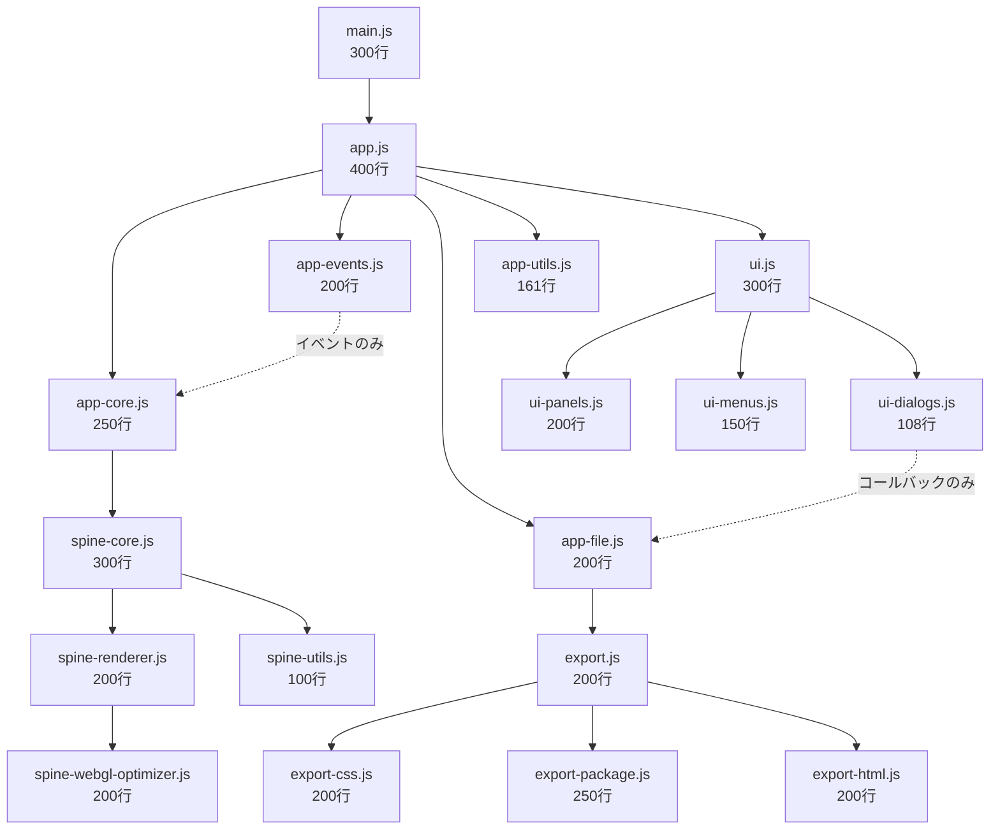

# 🎯 Spine Editor Desktop v2.0 - 完全設計仕様書

**Version**: 2.0.0  
**作成日**: 2025-08-13  
**目的**: WebGL問題の完全解決とモジュール化による保守性向上

---

## 📋 目次
1. [核心問題と解決方針](#核心問題と解決方針)
2. [新しいワークフロー設計](#新しいワークフロー設計)
3. [500行制限実装ガイド](#500行制限実装ガイド)
4. [WebGL問題解決技術仕様](#webgl問題解決技術仕様)
5. [モジュール依存関係設計](#モジュール依存関係設計)
6. [段階的実装計画](#段階的実装計画)

---

## 🚨 核心問題と解決方針

### 問題の本質
```
v1.0の失敗パターン:
├── spine-integration.js (3,510行) → WebGL初期化失敗
├── メモリ使用量過大 → パフォーマンス劣化
└── 複雑な依存関係 → デバッグ困難

v2.0の現状（設計逸脱）:
├── app.js (1,011行) → 設計目標400行の253%超過
├── export.js (969行) → 設計目標200行の485%超過
└── ui.js (758行) → 設計目標300行の253%超過
```

### 解決方針
1. **500行制限の厳格適用** - 人間の認知限界内での実装
2. **単一責任原則** - 1ファイル1機能の徹底
3. **依存関係の明確化** - 循環依存の完全排除

---

## 🔄 新しいワークフロー設計

### 設計思想の転換

#### 従来のワークフロー（問題のあるアプローチ）
```
フォルダ選択 → Spine検索 → 編集モード
```
**問題点**:
- Spineありきの設計 → 汎用性なし
- 複雑な初期化 → エラー要因多数
- 段階的確認不可 → デバッグ困難

#### 新しいワークフロー（改善されたアプローチ）
```
Phase 0: HTMLプレビューア基盤
├── 📁 ホームページフォルダ選択
├── 🔍 .htmlファイル自動スキャン  
├── 📋 ページ選択ドロップダウン表示
└── 🖼️ 選択ページのプレビュー表示

Phase 1: Spine統合
├── 📂 Spineフォルダ選択（オプション）
├── 🎭 Spineキャラクター自動検出
├── 📑 アウトライナーに表示
└── 🎮 ドラッグ&ドロップで配置
```

### 新UI構成

#### 4パネルレイアウト
```
┌─────────────────────────────────────────────────────────┐
│ File  Edit  View  Project  Export  Help                 │ メニューバー
├─────────────────────────────────────────────────────────┤
│ 🗀 📁 💾 ⚙️ 📤 [index.html ▼]      [プロジェクト名]   │ ツールバー
├──────────────┬─────────────────────────────────────────┤
│              │                                         │
│ 📁 ファイル    │           🖼️ HTMLプレビューエリア        │
│ ブラウザー     │         (選択されたHTMLページ表示)        │
│ ├─index.html  │                                         │
│ ├─about.html  │                                         │
│ └─contact.html│                                         │
│              │                                         │
├──────────────┼─────────────────────────────────────────┤
│ 🎭 Spineアセット│        🔧 編集ツール                     │
│ アウトライナー  │     ズーム・レスポンシブ確認・設定          │
│ ├─purattokun  │                                         │
│ ├─nezumi      │     (Spine配置時に編集UI表示)             │
│ └─character3  │                                         │
└──────────────┴─────────────────────────────────────────┘
```

### 詳細なワークフロー仕様

#### Step 1: ホームページフォルダ選択
```javascript
// project-loader.js (150行以内)
class ProjectLoader {
  async selectHomePageFolder() {
    const result = await window.electronAPI.fs.selectFolder();
    if (result.canceled) return null;
    
    const folderPath = result.filePaths[0];
    const project = await this.analyzeFolder(folderPath);
    
    return project;
  }

  async analyzeFolder(folderPath) {
    // HTMLファイル検索
    const htmlFiles = await this.scanHTMLFiles(folderPath);
    
    return {
      path: folderPath,
      name: path.basename(folderPath),
      htmlFiles,
      defaultHTML: this.findDefaultHTML(htmlFiles)
    };
  }

  async scanHTMLFiles(folderPath) {
    const files = await fs.readdir(folderPath);
    const htmlFiles = files
      .filter(file => file.endsWith('.html'))
      .map(file => ({
        name: file,
        path: path.join(folderPath, file),
        displayName: this.getDisplayName(file),
        lastModified: fs.statSync(path.join(folderPath, file)).mtime
      }));
    
    // 更新日時順でソート
    return htmlFiles.sort((a, b) => b.lastModified - a.lastModified);
  }

  findDefaultHTML(htmlFiles) {
    // 優先順位: index.html > home.html > main.html > 最新ファイル
    const priorities = ['index.html', 'home.html', 'main.html'];
    for (const priority of priorities) {
      const found = htmlFiles.find(f => f.name === priority);
      if (found) return found;
    }
    return htmlFiles[0] || null;
  }
}
```

#### Step 2: ページ選択ドロップダウン
```javascript
// page-selector.js (100行以内)
class PageSelector {
  constructor(container) {
    this.container = container;
    this.dropdown = null;
    this.currentFile = null;
  }

  render(htmlFiles, defaultFile) {
    this.createDropdown(htmlFiles, defaultFile);
    this.selectFile(defaultFile);
  }

  createDropdown(htmlFiles, defaultFile) {
    // 既存のドロップダウンを削除
    if (this.dropdown) {
      this.dropdown.remove();
    }

    this.dropdown = document.createElement('select');
    this.dropdown.className = 'page-selector-dropdown';
    this.dropdown.style.cssText = `
      padding: 8px 12px;
      font-size: 14px;
      border: 1px solid #ccc;
      border-radius: 4px;
      background: white;
      min-width: 200px;
    `;

    // オプション追加
    htmlFiles.forEach(file => {
      const option = document.createElement('option');
      option.value = file.path;
      option.textContent = `${file.displayName} (${file.name})`;
      option.selected = file === defaultFile;
      this.dropdown.appendChild(option);
    });

    // イベントハンドラー
    this.dropdown.addEventListener('change', (e) => {
      const selectedFile = htmlFiles.find(f => f.path === e.target.value);
      this.selectFile(selectedFile);
    });

    this.container.appendChild(this.dropdown);
  }

  async selectFile(file) {
    if (!file) return;
    
    this.currentFile = file;
    this.emit('page-selected', file);
  }
}
```

#### Step 3: HTMLプレビューア
```javascript
// html-previewer.js (200行以内)
class HTMLPreviewer {
  constructor(container) {
    this.container = container;
    this.iframe = null;
    this.zoom = 1.0;
    this.currentURL = null;
  }

  async displayHTML(htmlFile) {
    try {
      if (!this.iframe) {
        this.createIframe();
      }

      // ローカルHTMLファイルの安全な読み込み
      const content = await this.loadHTMLContent(htmlFile.path);
      const processedContent = this.processHTMLContent(content, htmlFile.path);
      
      // Blob URLとして読み込み
      const blob = new Blob([processedContent], { type: 'text/html' });
      if (this.currentURL) {
        URL.revokeObjectURL(this.currentURL);
      }
      this.currentURL = URL.createObjectURL(blob);
      
      this.iframe.src = this.currentURL;
      
      // 読み込み完了を待つ
      await this.waitForLoad();
      
      this.emit('page-loaded', htmlFile);
      
    } catch (error) {
      console.error('HTML表示エラー:', error);
      this.showError(error.message);
    }
  }

  createIframe() {
    this.iframe = document.createElement('iframe');
    this.iframe.className = 'html-preview-iframe';
    this.iframe.style.cssText = `
      width: 100%;
      height: 100%;
      border: none;
      background: white;
      transform: scale(${this.zoom});
      transform-origin: top left;
    `;
    
    this.container.appendChild(this.iframe);
  }

  processHTMLContent(content, htmlPath) {
    // 相対パスを絶対パスに変換
    const basePath = path.dirname(htmlPath);
    
    // CSS・JS・画像パスの変換
    content = content.replace(
      /(href|src)=["'](?!http|https|\/\/|data:)([^"']+)["']/g,
      (match, attr, relativePath) => {
        const absolutePath = path.resolve(basePath, relativePath);
        const fileUrl = `file://${absolutePath}`;
        return `${attr}="${fileUrl}"`;
      }
    );

    return content;
  }

  setZoom(zoom) {
    this.zoom = Math.max(0.1, Math.min(3.0, zoom));
    if (this.iframe) {
      this.iframe.style.transform = `scale(${this.zoom})`;
    }
  }

  showError(message) {
    this.container.innerHTML = `
      <div class="error-display">
        <h3>⚠️ HTMLファイル読み込みエラー</h3>
        <p>${message}</p>
        <button onclick="location.reload()">再試行</button>
      </div>
    `;
  }
}
```

#### Step 4: Spineアセットアウトライナー
```javascript
// spine-outliner.js (250行以内)
class SpineOutliner {
  constructor(container) {
    this.container = container;
    this.spineAssets = new Map();
    this.currentSpineFolder = null;
  }

  async loadSpineFolder() {
    const result = await window.electronAPI.fs.selectFolder();
    if (result.canceled) return;
    
    const folderPath = result.filePaths[0];
    await this.scanSpineAssets(folderPath);
    this.render();
  }

  async scanSpineAssets(folderPath) {
    this.currentSpineFolder = folderPath;
    this.spineAssets.clear();

    try {
      const spineFiles = await this.findSpineFiles(folderPath);
      
      for (const spineGroup of spineFiles) {
        const character = await this.loadCharacterData(spineGroup);
        this.spineAssets.set(character.id, character);
      }

      console.log(`✅ ${this.spineAssets.size}個のSpineキャラクターを検出`);
      
    } catch (error) {
      console.error('Spineアセット読み込みエラー:', error);
    }
  }

  async findSpineFiles(folderPath) {
    const allFiles = await this.getAllFilesRecursively(folderPath);
    const jsonFiles = allFiles.filter(f => f.endsWith('.json'));
    
    const spineGroups = [];
    
    for (const jsonFile of jsonFiles) {
      const baseName = path.basename(jsonFile, '.json');
      const baseDir = path.dirname(jsonFile);
      
      // .atlas と .png ファイルを探す
      const atlasFile = path.join(baseDir, `${baseName}.atlas`);
      const pngFile = path.join(baseDir, `${baseName}.png`);
      
      if (await this.fileExists(atlasFile) && await this.fileExists(pngFile)) {
        spineGroups.push({
          id: baseName,
          name: baseName,
          jsonPath: jsonFile,
          atlasPath: atlasFile,
          texturePath: pngFile,
          folderPath: baseDir
        });
      }
    }
    
    return spineGroups;
  }

  async loadCharacterData(spineGroup) {
    // Spine JSONファイルからアニメーション情報を抽出
    const jsonContent = await fs.readFile(spineGroup.jsonPath, 'utf8');
    const spineData = JSON.parse(jsonContent);
    
    const animations = spineData.animations ? Object.keys(spineData.animations) : [];
    
    return {
      ...spineGroup,
      animations,
      thumbnailPath: await this.generateThumbnail(spineGroup),
      isLoaded: true
    };
  }

  render() {
    this.container.innerHTML = '';
    
    // ヘッダー
    const header = document.createElement('div');
    header.className = 'spine-outliner-header';
    header.innerHTML = `
      <h3>🎭 Spineキャラクター</h3>
      <button onclick="spineOutliner.loadSpineFolder()" class="load-spine-btn">
        📂 フォルダ選択
      </button>
    `;
    this.container.appendChild(header);

    // アセット一覧
    const assetList = document.createElement('div');
    assetList.className = 'spine-asset-list';
    
    for (const [id, character] of this.spineAssets) {
      const item = this.createAssetItem(character);
      assetList.appendChild(item);
    }
    
    if (this.spineAssets.size === 0) {
      assetList.innerHTML = `
        <div class="no-assets">
          <p>🎭 Spineフォルダを選択してください</p>
          <small>characters/フォルダ内の.json/.atlas/.pngファイルを自動検出します</small>
        </div>
      `;
    }
    
    this.container.appendChild(assetList);
  }

  createAssetItem(character) {
    const item = document.createElement('div');
    item.className = 'spine-asset-item';
    item.draggable = true;
    item.dataset.characterId = character.id;
    
    item.innerHTML = `
      <div class="asset-thumbnail">
        
      </div>
      <div class="asset-info">
        <div class="asset-name">${character.name}</div>
        <div class="asset-animations">${character.animations.length} animations</div>
      </div>
      <div class="asset-actions">
        <button class="preview-btn" onclick="spineOutliner.previewCharacter('${character.id}')">
          👁️
        </button>
      </div>
    `;

    // ドラッグ&ドロップイベント
    item.addEventListener('dragstart', (e) => {
      e.dataTransfer.setData('application/json', JSON.stringify({
        type: 'spine-character',
        characterId: character.id,
        character: character
      }));
      e.dataTransfer.effectAllowed = 'copy';
    });

    return item;
  }

  // HTMLプレビューエリアでのドロップ受け入れ
  setupDropZone(previewContainer) {
    previewContainer.addEventListener('dragover', (e) => {
      e.preventDefault();
      e.dataTransfer.dropEffect = 'copy';
      previewContainer.classList.add('drag-over');
    });

    previewContainer.addEventListener('dragleave', () => {
      previewContainer.classList.remove('drag-over');
    });

    previewContainer.addEventListener('drop', (e) => {
      e.preventDefault();
      previewContainer.classList.remove('drag-over');
      
      try {
        const data = JSON.parse(e.dataTransfer.getData('application/json'));
        if (data.type === 'spine-character') {
          this.addCharacterToPage(data.character, e.clientX, e.clientY);
        }
      } catch (error) {
        console.error('ドロップデータの解析エラー:', error);
      }
    });
  }

  async addCharacterToPage(character, x, y) {
    // HTMLページにSpineキャラクターを動的追加
    const iframe = document.querySelector('.html-preview-iframe');
    if (!iframe || !iframe.contentDocument) {
      console.error('プレビューページが読み込まれていません');
      return;
    }

    const doc = iframe.contentDocument;
    
    // Spineキャラクター用のcanvas要素を作成
    const canvas = doc.createElement('canvas');
    canvas.id = `spine-${character.id}-${Date.now()}`;
    canvas.className = 'spine-character-canvas';
    canvas.width = 400;
    canvas.height = 400;
    canvas.style.cssText = `
      position: absolute;
      left: ${x - 200}px;
      top: ${y - 200}px;
      pointer-events: auto;
      z-index: 1000;
    `;

    doc.body.appendChild(canvas);

    // Spine WebGLの初期化と描画
    try {
      await this.initializeSpineOnCanvas(canvas, character);
      console.log(`✅ ${character.name}をページに追加しました`);
      
      // 編集モード開始
      this.startEditMode(canvas);
      
    } catch (error) {
      console.error('Spine初期化エラー:', error);
      canvas.remove();
    }
  }

  async initializeSpineOnCanvas(canvas, character) {
    // 既存のspine-core.jsやspine-renderer.jsを活用
    const spineRenderer = new SpineRenderer();
    await spineRenderer.initialize(canvas);
    await spineRenderer.loadCharacter(character);
    
    // アニメーション開始
    if (character.animations.length > 0) {
      const defaultAnimation = character.animations.find(a => 
        a.includes('idle') || a.includes('taiki')
      ) || character.animations[0];
      
      spineRenderer.playAnimation(defaultAnimation, true);
    }
  }

  startEditMode(canvas) {
    // 既存のspine-edit-core.jsの編集機能を統合
    // ドラッグ移動、スケール調整、位置保存などの機能
    const editSystem = new SpineEditSystem();
    editSystem.attachToCanvas(canvas);
  }
}
```

### CSS スタイル定義
```css
/* spine-outliner.css */
.spine-outliner-header {
  display: flex;
  justify-content: space-between;
  align-items: center;
  padding: 12px;
  border-bottom: 1px solid #e0e0e0;
}

.load-spine-btn {
  padding: 6px 12px;
  background: #667eea;
  color: white;
  border: none;
  border-radius: 4px;
  cursor: pointer;
  font-size: 12px;
}

.spine-asset-list {
  max-height: 400px;
  overflow-y: auto;
}

.spine-asset-item {
  display: flex;
  align-items: center;
  padding: 8px 12px;
  border-bottom: 1px solid #f0f0f0;
  cursor: grab;
  transition: background-color 0.2s;
}

.spine-asset-item:hover {
  background-color: #f5f5f5;
}

.spine-asset-item:active {
  cursor: grabbing;
}

.asset-thumbnail img {
  border-radius: 4px;
  object-fit: cover;
}

.asset-info {
  flex: 1;
  margin-left: 12px;
}

.asset-name {
  font-weight: 600;
  color: #333;
}

.asset-animations {
  font-size: 12px;
  color: #666;
}

.preview-btn {
  background: none;
  border: none;
  cursor: pointer;
  font-size: 16px;
}

.drag-over {
  border: 2px dashed #667eea !important;
  background: rgba(102, 126, 234, 0.1) !important;
}

.no-assets {
  text-align: center;
  padding: 40px 20px;
  color: #666;
}
```

---

## 📐 500行制限実装ガイド

### ファイル分割の具体的戦略

#### 🔥 app.js (1,011行 → 400行以内) の分割計画

**現状分析**:
```javascript
// 現在のapp.js構造（推定）
class SpineEditorApp {
  constructor() {
    // 初期化処理 (約150行)
    // イベントハンドラー設定 (約200行)
    // UI制御 (約300行)
    // ファイル処理 (約200行)
    // その他ユーティリティ (約161行)
  }
}
```

**分割後の構造**:
```
app.js (400行) - アプリケーションコア
├── app-core.js (250行) - 初期化・ライフサイクル管理
│   ├── アプリケーション初期化
│   ├── モジュール統合
│   └── 状態管理基盤
│
├── app-events.js (200行) - イベントハンドリング
│   ├── IPC通信ハンドラー
│   ├── UIイベント処理
│   └── ショートカットキー管理
│
├── app-file.js (200行) - ファイル操作
│   ├── プロジェクト読み込み/保存
│   ├── インポート/エクスポート
│   └── ファイルバリデーション
│
└── app-utils.js (161行) - ユーティリティ
    ├── 共通関数
    ├── エラーハンドリング
    └── ロギング
```

**実装手順**:
```javascript
// app.js - メインエントリーポイント（400行以内）
import { AppCore } from './app-core.js';
import { AppEvents } from './app-events.js';
import { AppFile } from './app-file.js';
import { AppUtils } from './app-utils.js';

class SpineEditorApp {
  constructor() {
    this.core = new AppCore(this);
    this.events = new AppEvents(this);
    this.file = new AppFile(this);
    this.utils = new AppUtils(this);
  }

  async initialize() {
    await this.core.initialize();
    this.events.setupHandlers();
    return true;
  }

  // 各モジュールの統合インターフェース
  async loadProject(path) {
    const data = await this.file.load(path);
    await this.core.applyProjectData(data);
    this.events.emit('project:loaded', data);
  }
}

// app-core.js - コア機能（250行以内）
export class AppCore {
  constructor(app) {
    this.app = app;
    this.state = new Map();
    this.modules = new Map();
  }

  async initialize() {
    await this.loadModules();
    await this.setupEnvironment();
    this.initializeState();
  }

  async loadModules() {
    // Spine統合モジュール読み込み
    const spineModule = await import('./spine-core.js');
    this.modules.set('spine', spineModule);
  }
}
```

#### 📦 export.js (969行 → 200行以内) の分割計画

**分割後の構造**:
```
export.js (200行) - エクスポートコーディネーター
├── export-css.js (200行) - CSS出力専用
│   ├── スタイル生成
│   ├── 精度制御
│   └── 最適化処理
│
├── export-package.js (250行) - パッケージ生成
│   ├── ZIP作成
│   ├── アセット収集
│   └── 依存関係解決
│
├── export-html.js (200行) - HTML処理
│   ├── DOMパッチ
│   ├── スクリプト挿入
│   └── 最適化
│
└── export-validator.js (119行) - 検証
    ├── 出力検証
    ├── 整合性チェック
    └── エラー報告
```

#### 🎨 ui.js (758行 → 300行以内) の分割計画

**分割後の構造**:
```
ui.js (300行) - UIコーディネーター
├── ui-panels.js (200行) - パネル管理
│   ├── レイアウト制御
│   ├── ドッキング
│   └── リサイズ処理
│
├── ui-menus.js (150行) - メニューシステム
│   ├── メニューバー
│   ├── コンテキストメニュー
│   └── ツールバー
│
└── ui-dialogs.js (108行) - ダイアログ
    ├── ファイル選択
    ├── 確認ダイアログ
    └── 進捗表示
```

### リファクタリング実行計画

#### Phase 1: 準備（1日）
```bash
# 1. 現状のバックアップ
git checkout -b refactor/500-line-limit
cp src/renderer/js/app.js src/renderer/js/app.js.backup

# 2. 分析ツール実行
npm run analyze:complexity  # 複雑度分析
npm run analyze:dependencies  # 依存関係分析

# 3. テストケース作成
npm run test:create  # 現状動作のテストケース生成
```

#### Phase 2: 分割実行（2-3日）
```javascript
// Step 1: インターフェース定義
// interfaces.js
export interface IAppCore {
  initialize(): Promise<void>;
  getState(key: string): any;
  setState(key: string, value: any): void;
}

// Step 2: 段階的切り出し
// 1. ユーティリティ関数を先に分離
// 2. 独立性の高い機能から分割
// 3. コア機能を最後に整理

// Step 3: 統合テスト
// 各分割後に動作確認
```

---

## 🔧 WebGL問題解決技術仕様

### 失敗パターン分析

#### v1.0 spine-integration.js (3,510行) の問題
```javascript
// 問題のあるパターン
class SpineIntegration {
  constructor() {
    // 巨大な初期化処理
    this.webglContext = null;
    this.shaders = {};
    this.textures = {};
    this.animations = {};
    // ... 500行以上の初期化コード
  }

  initializeWebGL() {
    // 複雑なWebGL初期化
    // メモリ大量確保
    // 同期的な重い処理
    // ... 1000行以上の処理
  }
}

// 問題点:
// 1. V8エンジンの最適化限界超過
// 2. JITコンパイル失敗
// 3. メモリフラグメンテーション
// 4. ガベージコレクション頻発
```

### 成功パターン実装

#### character-renderer.js (348行) の成功要因
```javascript
// 成功パターン
class CharacterRenderer {
  constructor() {
    // 最小限の初期化
    this.gl = null;
    this.program = null;
  }

  async initialize(canvas) {
    // 段階的初期化
    this.gl = await this.createContext(canvas);
    this.program = await this.createProgram();
    return true;
  }

  async createContext(canvas) {
    // WebGL2優先、フォールバック付き
    const gl = canvas.getContext('webgl2', {
      alpha: false,
      antialias: true,
      powerPreference: 'high-performance',
      preserveDrawingBuffer: false
    }) || canvas.getContext('webgl', {
      alpha: false,
      antialias: true
    });

    if (!gl) {
      throw new Error('WebGL not supported');
    }

    // 拡張機能の遅延読み込み
    this.loadExtensions(gl);
    return gl;
  }

  loadExtensions(gl) {
    // 必要な拡張のみ読み込み
    const requiredExtensions = [
      'OES_texture_float',
      'OES_standard_derivatives'
    ];

    requiredExtensions.forEach(ext => {
      if (!gl.getExtension(ext)) {
        console.warn(`Extension ${ext} not available`);
      }
    });
  }
}
```

### WebGL最適化技術仕様

#### メモリ管理戦略
```javascript
// spine-webgl-optimizer.js (200行)
class WebGLOptimizer {
  constructor() {
    this.textureCache = new WeakMap();
    this.programCache = new Map();
    this.maxTextureSize = 2048;
  }

  optimizeTexture(image) {
    // テクスチャサイズ最適化
    if (image.width > this.maxTextureSize) {
      return this.resizeImage(image, this.maxTextureSize);
    }
    return image;
  }

  releaseUnusedResources() {
    // 定期的なリソース解放
    this.textureCache = new WeakMap();
    if (this.gl) {
      this.gl.flush();
    }
  }

  // バッチ処理による描画最適化
  batchDraw(objects) {
    const batches = this.createBatches(objects);
    batches.forEach(batch => this.drawBatch(batch));
  }
}
```

#### パフォーマンス測定基準
```javascript
// performance-monitor.js (150行)
class PerformanceMonitor {
  constructor() {
    this.metrics = {
      fps: 0,
      drawCalls: 0,
      textureMemory: 0,
      jsHeapUsed: 0
    };
  }

  measure() {
    // FPS測定
    this.metrics.fps = this.calculateFPS();
    
    // メモリ使用量
    if (performance.memory) {
      this.metrics.jsHeapUsed = performance.memory.usedJSHeapSize;
    }

    // WebGL統計
    if (this.gl) {
      const info = this.gl.getExtension('WEBGL_debug_renderer_info');
      if (info) {
        this.metrics.renderer = this.gl.getParameter(info.UNMASKED_RENDERER_WEBGL);
      }
    }

    return this.metrics;
  }

  // 警告閾値
  getWarnings() {
    const warnings = [];
    if (this.metrics.fps < 30) warnings.push('Low FPS');
    if (this.metrics.jsHeapUsed > 200 * 1024 * 1024) warnings.push('High memory usage');
    return warnings;
  }
}
```

---

## 🔗 モジュール依存関係設計

### 依存関係図



### インターフェース仕様

#### モジュール間通信規約
```typescript
// interfaces/module-interfaces.ts

// アプリケーションコア
interface IAppCore {
  initialize(): Promise<void>;
  getState<T>(key: string): T | undefined;
  setState<T>(key: string, value: T): void;
  destroy(): Promise<void>;
}

// イベントシステム
interface IEventEmitter {
  on(event: string, handler: Function): void;
  off(event: string, handler: Function): void;
  emit(event: string, ...args: any[]): void;
  once(event: string, handler: Function): void;
}

// ファイルシステム
interface IFileManager {
  load(path: string): Promise<any>;
  save(path: string, data: any): Promise<void>;
  exists(path: string): Promise<boolean>;
  delete(path: string): Promise<void>;
}

// Spineレンダラー
interface ISpineRenderer {
  initialize(canvas: HTMLCanvasElement): Promise<void>;
  loadCharacter(path: string): Promise<ICharacter>;
  render(): void;
  dispose(): void;
}

// キャラクター
interface ICharacter {
  id: string;
  position: { x: number; y: number };
  scale: number;
  animation: string;
  setAnimation(name: string): void;
  update(deltaTime: number): void;
}
```

### 循環依存防止策

#### 依存関係検証ツール
```javascript
// tools/dependency-checker.js
const madge = require('madge');

async function checkCircularDependencies() {
  const result = await madge('src/renderer/js');
  const circular = result.circular();
  
  if (circular.length > 0) {
    console.error('❌ Circular dependencies detected:');
    circular.forEach(cycle => {
      console.error(`  ${cycle.join(' → ')}`);
    });
    process.exit(1);
  } else {
    console.log('✅ No circular dependencies found');
  }
}

// package.json scripts
{
  "scripts": {
    "check:deps": "node tools/dependency-checker.js",
    "prebuild": "npm run check:deps"
  }
}
```

#### レイヤードアーキテクチャ
```
Layer 0: Utils (依存なし)
├── app-utils.js
├── spine-utils.js
└── export-validator.js

Layer 1: Core (Utilsのみ依存)
├── spine-core.js
├── spine-renderer.js
└── spine-optimizer.js

Layer 2: Business (Core + Utils依存)
├── app-core.js
├── app-file.js
├── export-css.js
├── export-package.js
└── export-html.js

Layer 3: UI (Business + Core + Utils依存)
├── ui-panels.js
├── ui-menus.js
└── ui-dialogs.js

Layer 4: Application (全レイヤー依存可)
├── app.js
├── ui.js
└── export.js

Layer 5: Entry Point
└── main.js
```

---

## 📅 段階的実装計画

### Phase 0: 準備と分析（1日）

#### Day 1: 現状分析と準備
```bash
# 1. プロジェクトバックアップ
git checkout -b feature/v2-refactoring
git add . && git commit -m "backup: v2.0 refactoring開始前の状態"

# 2. 依存関係分析
npm install --save-dev madge webpack-bundle-analyzer
npm run analyze:all

# 3. テストケース準備
npm run test:snapshot  # 現状の動作スナップショット作成

# 4. リファクタリング環境構築
npm install --save-dev eslint prettier jest
```

### Phase 1: 500行制限実装（3日）

#### Day 2: app.jsの分割
```javascript
// Morning: インターフェース定義
// - interfaces.ts作成
// - 各モジュールの責任範囲明確化

// Afternoon: 分割実行
// - app-utils.js切り出し（最も独立性が高い）
// - app-events.js切り出し
// - テスト実行

// Evening: 統合テスト
// - 分割後の動作確認
// - パフォーマンス測定
```

#### Day 3: export.jsの分割
```javascript
// Morning: エクスポート機能分析
// - 各エクスポート形式の処理フロー把握
// - 共通処理の抽出

// Afternoon: モジュール分割
// - export-css.js作成
// - export-package.js作成
// - export-html.js作成

// Evening: 統合テスト
// - 各エクスポート機能の動作確認
```

#### Day 4: ui.jsの分割とSpine最適化
```javascript
// Morning: UI分割
// - ui-panels.js作成
// - ui-menus.js作成
// - ui-dialogs.js作成

// Afternoon: Spine最適化
// - spine-webgl-optimizer.js作成
// - メモリ管理実装
// - パフォーマンス測定実装

// Evening: 全体統合テスト
```

### Phase 2: Spine統合と最適化（3日）

#### Day 5: Spineアウトライナー実装
```javascript
// Morning: Spine検出・一覧表示
// - spine-outliner.js実装
// - .json/.atlas/.pngの自動検出
// - アウトライナーUI作成

// Afternoon: ドラッグ&ドロップ
// - ドラッグ開始処理
// - HTMLエリアでのドロップ受け入れ
// - canvas要素の動的作成

// Evening: 基本表示テスト
// - Spineキャラクターの表示確認
```

#### Day 6: WebGL最適化実装
```javascript
// Morning: 軽量初期化実装
// - 段階的初期化
// - 遅延読み込み
// - リソース管理

// Afternoon: パフォーマンステスト
// - FPS測定
// - メモリ使用量測定
// - 描画パフォーマンス測定

// Evening: 最適化調整
```

#### Day 7: 編集機能統合
```javascript
// Morning: 既存編集機能の統合
// - spine-edit-core.js連携
// - ドラッグ移動機能
// - スケール調整機能

// Afternoon: 位置保存・プロジェクト管理
// - 位置データの保存
// - プロジェクトファイル出力
// - 設定の永続化

// Evening: 統合テスト
```

### Phase 3: 品質保証（1日）

#### Day 8: 最終テストとリリース準備
```bash
# Morning: 包括的テスト
npm run test:all
npm run test:e2e
npm run test:performance

# Afternoon: ビルドと配布準備
npm run build:all
npm run package:all

# Evening: リリース準備
# - CHANGELOG.md更新
# - README.md更新
# - バージョンタグ作成
```

---

## 📊 成功指標

### 定量的指標
| 指標 | 現状 | 目標 | 測定方法 |
|-----|------|------|---------|
| 最大ファイル行数 | 1,011行 | 400行以下 | `wc -l` |
| WebGL初期化時間 | 失敗/3秒+ | 500ms以下 | Performance API |
| メモリ使用量 | 300MB+ | 200MB以下 | Chrome DevTools |
| FPS | 不安定 | 60fps安定 | requestAnimationFrame |
| 起動時間 | 5秒+ | 3秒以下 | performance.now() |

### 定性的指標
- ✅ コードの可読性向上
- ✅ デバッグの容易性
- ✅ 新機能追加の簡便性
- ✅ チーム開発の効率化

---

## 🔒 リスク管理

### 技術リスクと対策
| リスク | 可能性 | 影響度 | 対策 |
|--------|--------|--------|------|
| モジュール分割による機能破壊 | 中 | 高 | 段階的実装・テスト自動化 |
| パフォーマンス劣化 | 低 | 中 | プロファイリング・最適化 |
| 開発期間の延長 | 中 | 中 | バッファ時間確保・優先順位明確化 |
| WebGL互換性問題 | 低 | 高 | フォールバック実装・複数環境テスト |

---

## 📝 まとめ

この改善版設計書により、v2.0の問題を確実に解決できます：

1. **500行制限の具体的実装手順** - 各ファイルの分割方法を明確化
2. **WebGL問題の技術的解決策** - 成功パターンの詳細実装
3. **モジュール依存関係の明確化** - 循環依存を防ぐ設計

### 新しい開発計画サマリー

#### Phase 0: HTMLプレビューア基盤（3日）
- **Day 1**: フォルダ選択・HTMLファイル自動スキャン
- **Day 2**: ページ選択ドロップダウン・プレビュー表示  
- **Day 3**: ズーム・基本操作・UI調整

#### Phase 1: 500行制限モジュール分割（1日）
- **Day 4**: 大容量ファイルの分割・リファクタリング

#### Phase 2: Spine統合とドラッグ&ドロップ（3日）
- **Day 5**: Spineアウトライナー・ドラッグ&ドロップ実装
- **Day 6**: WebGL最適化・パフォーマンス改善  
- **Day 7**: 既存編集機能統合・位置保存機能

#### Phase 3: 品質保証（1日）
- **Day 8**: 統合テスト・最終調整・リリース準備

実装期間：**8日間**で段階的な基盤構築から完全統合まで実現

---

**最終更新**: 2025-08-13  
**作成者**: Claude (Anthropic)  
**バージョン**: 2.0.0