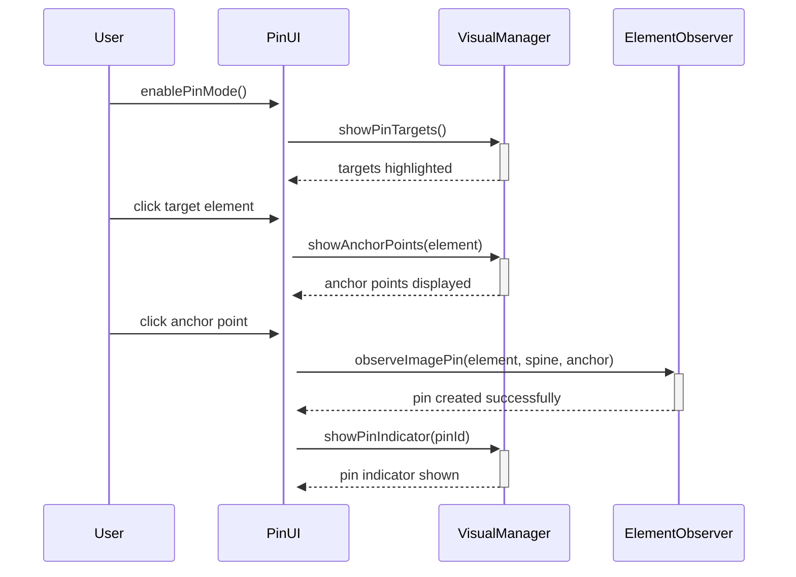
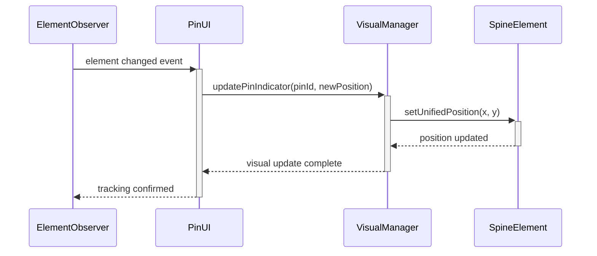

# ElementObserver Pin UI システム仕様書

**バージョン**: 1.0  
**対象**: ElementObserver Phase 3-B連携  
**作成日**: 2025-08-29  

---

## 🎯 概要

ElementObserver Pin UI システムは、ドラッグ&ドロップによる直感的な操作で、Spineキャラクターを任意の要素に「ピン留め」するビジュアルUIシステムです。

### 🚀 主要機能
- **🖱️ ドラッグ&ドロップ操作**: ピンアイコンを要素にドロップしてピン留め設定
- **📍 視覚的アンカー選択**: 9つのアンカーポイントを視覚的に選択
- **🔄 リアルタイム追従**: 要素のサイズ・位置変化に60fps対応で追従
- **📱 レスポンシブ対応**: PC・モバイル両対応の操作性
- **🎮 複数ピン管理**: 複数のピン設定を同時管理・視覚化

---

## 🎮 操作フロー

### Phase 1: ピン設定モード開始
1. **モード切り替えボタン**をクリック
2. ページ全体が「ピン設定モード」に切り替わる
3. 設定可能な要素に**青い境界線**が表示される
4. **ピンアイコン**がカーソル追従で表示される

### Phase 2: 対象要素の選択
1. **対象要素**（画像・テキスト・背景等）をクリック
2. 選択された要素に**オレンジ色のハイライト**が表示
3. **9つのアンカーポイント**が視覚的に表示される

### Phase 3: アンカーポイント選択
1. 9つのアンカーポイントから**最適な位置**を選択
2. 選択したポイントに**ピンアイコン**が表示される
3. **リアルタイムプレビュー**でSpine位置が即座に更新

### Phase 4: ピン確定・管理
1. **確定ボタン**でピン設定を保存
2. 設定されたピンは**ピンリスト**で管理可能
3. **編集・削除・一時無効化**がワンクリックで実行可能

---

## 📍 アンカーポイント仕様

### 9つのアンカーポイント配置
```
TL -------- TC -------- TR
|                       |
|                       |
ML         MC          MR
|                       |
|                       |
BL -------- BC -------- BR
```

### アンカーポイント詳細
| コード | 名称 | 位置 | 用途 |
|--------|------|------|------|
| `TL` | Top Left | 左上角 | ロゴ・アイコン配置 |
| `TC` | Top Center | 上端中央 | タイトル・ヘッダー |
| `TR` | Top Right | 右上角 | メニュー・通知 |
| `ML` | Middle Left | 左端中央 | サイドナビ・補助情報 |
| `MC` | Middle Center | 中央 | **デフォルト・メインコンテンツ** |
| `MR` | Middle Right | 右端中央 | サイドバー・関連情報 |
| `BL` | Bottom Left | 左下角 | フッター・著作権 |
| `BC` | Bottom Center | 下端中央 | ページ送り・アクション |
| `BR` | Bottom Right | 右下角 | **推奨・サポート・リンク** |

---

## 🎨 UI要素設計

### ピンアイコン
```css
.pin-icon {
    width: 24px;
    height: 24px;
    background: linear-gradient(45deg, #ff6b6b, #4ecdc4);
    border-radius: 50% 50% 50% 0;
    box-shadow: 0 2px 8px rgba(0,0,0,0.3);
    cursor: grab;
    transform: rotate(-45deg);
}
```

### アンカーポイント表示
```css
.anchor-point {
    width: 16px;
    height: 16px;
    background: rgba(255, 107, 107, 0.8);
    border: 2px solid white;
    border-radius: 50%;
    cursor: pointer;
    transition: all 0.2s ease;
}

.anchor-point:hover {
    transform: scale(1.3);
    background: #ff6b6b;
}

.anchor-point.selected {
    background: #4ecdc4;
    transform: scale(1.2);
}
```

### ハイライト表示
```css
.pin-target-highlight {
    outline: 3px solid #4ecdc4;
    outline-offset: 2px;
    animation: pulse-highlight 1.5s ease-in-out infinite;
}

@keyframes pulse-highlight {
    0%, 100% { outline-color: #4ecdc4; }
    50% { outline-color: #ff6b6b; }
}
```

---

## 🛠️ 技術仕様

### マイクロモジュール構成
```
micromodules/pin-system/
├── ElementObserverPinUI.js          (主制御・4.8KB)
├── PinVisualManager.js              (視覚化・3.2KB) 
├── PinInteractionHandler.js         (イベント処理・2.9KB)
└── pin-ui-styles.css                (UI専用CSS・1.8KB)
```

### API設計
```javascript
// ElementObserverPinUI メインクラス
class ElementObserverPinUI {
    constructor(elementObserver, options = {}) {
        this.observer = elementObserver;
        this.visualManager = new PinVisualManager();
        this.interactionHandler = new PinInteractionHandler(this);
        this.pins = new Map(); // pinId -> pinConfig
    }
    
    // ピン設定モード開始
    enablePinMode(options = {}) { ... }
    
    // ピン設定モード終了
    disablePinMode() { ... }
    
    // ピン作成
    createPin(targetElement, anchorPoint, spineElement) { ... }
    
    // ピン削除
    removePin(pinId) { ... }
    
    // 全ピン管理
    getAllPins() { ... }
    listActivePins() { ... }
    togglePin(pinId, enabled) { ... }
}
```

### イベント仕様
```javascript
// ピン操作イベント
pinUI.on('pin-created', (pinData) => {
    console.log('ピン作成:', pinData);
});

pinUI.on('pin-updated', (pinId, newPosition) => {
    console.log('ピン更新:', pinId, newPosition);
});

pinUI.on('pin-removed', (pinId) => {
    console.log('ピン削除:', pinId);
});

// エラーイベント
pinUI.on('pin-error', (error) => {
    console.error('ピンエラー:', error);
});
```

---

## 🔄 動作シーケンス

### ピン作成シーケンス


### リアルタイム追従シーケンス


---

## 📱 レスポンシブ対応

### PC版操作
- **マウスホバー**: アンカーポイントのプレビュー表示
- **右クリック**: コンテキストメニュー（編集・削除）
- **ドラッグ**: ピンアイコンのドラッグ&ドロップ
- **ショートカット**: `P`キー でピン設定モード切り替え

### モバイル版操作
- **タッチ**: タップでアンカーポイント選択
- **長押し**: 詳細設定メニュー表示
- **ジェスチャー**: 2本指ピンチでズーム調整
- **画面サイズ**: アンカーポイントサイズを自動調整

### ブレークポイント
```css
/* モバイル：アンカーポイント大型化 */
@media (max-width: 768px) {
    .anchor-point {
        width: 20px;
        height: 20px;
    }
    
    .pin-icon {
        width: 28px;
        height: 28px;
    }
}

/* タッチデバイス：ホバー効果無効化 */
@media (hover: none) {
    .anchor-point:hover {
        transform: none;
    }
}
```

---

## ⚡ パフォーマンス要件

### 応答性能
- **ピン作成時間**: < 50ms
- **アンカーポイント表示**: < 30ms  
- **リアルタイム追従**: 60fps維持
- **UI切り替え**: < 100ms

### メモリ効率
- **ピンUI基本メモリ**: < 2MB
- **ピン1個あたり**: < 50KB
- **最大同時ピン数**: 20個
- **メモリリーク**: 完全防止（cleanup実装）

### パフォーマンス最適化
```javascript
// 最適化技術の活用
class ElementObserverPinUI {
    constructor(observer) {
        this.observer = observer;
        
        // Phase 3-A 超高速パス利用
        this.useUltraFastPath = true;
        
        // バッチ処理によるDOM更新最適化
        this.batchDOMUpdates = true;
        
        // アンカーポイント位置キャッシュ
        this.anchorCache = new Map();
    }
}
```

---

## 🚨 エラーハンドリング

### エラー分類
| エラータイプ | 原因 | 対処法 |
|-------------|------|--------|
| `InvalidTarget` | 対象要素が無効 | 要素の有効性チェック・フォールバック表示 |
| `AnchorOutOfBounds` | アンカーが範囲外 | 最寄りの有効アンカーに自動調整 |
| `SpineNotFound` | Spine要素が見つからない | Spine要素の存在確認・エラー通知 |
| `DOMUpdateFailed` | DOM更新失敗 | リトライ処理・安全な状態に復元 |
| `MemoryLimitExceeded` | メモリ制限超過 | 古いピンの自動削除・警告表示 |

### エラー回復機能
```javascript
class PinErrorHandler {
    handlePinCreationError(error, targetElement, anchorPoint) {
        switch (error.type) {
            case 'InvalidTarget':
                this.showUserMessage('この要素はピン設定できません');
                this.highlightValidTargets();
                break;
                
            case 'AnchorOutOfBounds':
                const fallbackAnchor = this.findNearestValidAnchor(anchorPoint);
                this.showUserMessage(`最寄りのアンカー(${fallbackAnchor})に設定します`);
                return this.createPinWithAnchor(targetElement, fallbackAnchor);
                
            case 'SpineNotFound':
                this.showSpineSelectionDialog();
                break;
        }
    }
}
```

---

## 🎯 ユーザー体験設計

### 操作フィードバック
- **ホバー効果**: アンカーポイントの拡大・色変更
- **クリック反応**: ボタン押下アニメーション
- **進行状況**: プログレスバー・ローディング表示
- **成功通知**: 緑色のチェックマーク・確認音
- **エラー表示**: 赤色の警告・説明メッセージ

### アクセシビリティ
```html
<!-- セマンティックHTML -->
<div role="application" aria-label="Spine Pin Setting Interface">
    <button aria-label="ピン設定モード開始" class="pin-mode-toggle">
        📍 ピン設定
    </button>
    
    <div role="region" aria-label="アンカーポイント選択">
        <button role="option" aria-label="左上角" data-anchor="TL">
            TL
        </button>
        <!-- 他のアンカーポイント -->
    </div>
</div>
```

### キーボードナビゲーション
- **Tab**: アンカーポイント間移動
- **Enter/Space**: アンカーポイント選択
- **Escape**: ピン設定モード終了
- **Delete**: 選択中のピン削除

---

## 💾 データ永続化

### ローカルストレージ構造
```json
{
  "elementObserverPins": {
    "version": "1.0",
    "pins": [
      {
        "id": "pin_001",
        "targetSelector": "#hero-image",
        "anchorPoint": "BR",
        "spineSelector": "#character-spine",
        "enabled": true,
        "createdAt": "2025-08-29T10:30:00Z",
        "options": {
          "responsive": true,
          "offset": { "x": 5, "y": -10 }
        }
      }
    ],
    "settings": {
      "autoSave": true,
      "maxPins": 20,
      "defaultAnchor": "MC"
    }
  }
}
```

### インポート・エクスポート機能
```javascript
class PinDataManager {
    // 設定のエクスポート
    exportPinConfiguration() {
        return JSON.stringify(this.getAllPins(), null, 2);
    }
    
    // 設定のインポート
    importPinConfiguration(jsonData) {
        const config = JSON.parse(jsonData);
        return this.loadPinsFromConfig(config);
    }
    
    // 設定の共有用URL生成
    generateShareURL() {
        const config = this.exportPinConfiguration();
        const encoded = btoa(config);
        return `${location.origin}${location.pathname}?pins=${encoded}`;
    }
}
```

---

## 🧪 テスト仕様

### 単体テスト
```javascript
describe('ElementObserverPinUI', () => {
    test('ピン作成が正常に動作する', async () => {
        const pinUI = new ElementObserverPinUI(mockObserver);
        const result = await pinUI.createPin(targetElement, 'BR', spineElement);
        expect(result.success).toBe(true);
        expect(result.pinId).toBeDefined();
    });
    
    test('無効な要素でエラーハンドリング', async () => {
        const pinUI = new ElementObserverPinUI(mockObserver);
        const result = await pinUI.createPin(null, 'BR', spineElement);
        expect(result.success).toBe(false);
        expect(result.error.type).toBe('InvalidTarget');
    });
});
```

### 統合テスト
```javascript
describe('Pin System Integration', () => {
    test('ElementObserverとの連携', async () => {
        const observer = new ElementObserverAdvanced();
        const pinUI = new ElementObserverPinUI(observer);
        
        const pin = await pinUI.createPin(imageElement, 'TR', spineElement);
        
        // 要素のサイズ変更をシミュレート
        imageElement.style.width = '200px';
        await waitForUpdate();
        
        // Spineの位置が正しく更新されているかチェック
        const spinePosition = getSpinePosition(spineElement);
        expect(spinePosition.x).toBeCloseTo(expectedX, 1);
        expect(spinePosition.y).toBeCloseTo(expectedY, 1);
    });
});
```

### E2Eテスト
```javascript
describe('Pin UI User Experience', () => {
    test('ドラッグ&ドロップフロー', async () => {
        await page.click('#pin-mode-toggle');
        await page.waitForSelector('.pin-target-highlight');
        
        await page.click('#target-image');
        await page.waitForSelector('.anchor-point');
        
        await page.click('.anchor-point[data-anchor="BR"]');
        await page.waitForSelector('.pin-indicator');
        
        const pinIndicator = await page.$('.pin-indicator');
        expect(pinIndicator).toBeTruthy();
    });
});
```

---

## 🚀 将来拡張

### Phase 2 拡張機能
- **アニメーション設定**: ピン追従時のスムーズアニメーション
- **条件付きピン**: 画面サイズ・デバイス条件による自動切り替え
- **グループピン**: 複数ピンの一括管理・同期移動
- **カスタムアンカー**: 独自の座標指定によるピン配置

### Phase 3 高度機能
- **AIアシスト**: 最適なアンカーポイントの自動提案
- **パフォーマンス分析**: ピン追従の負荷測定・最適化提案
- **デザインシステム統合**: デザインツールからのピン設定インポート
- **多言語対応**: UI・エラーメッセージの国際化対応

---

## 📊 成功指標

### 操作性指標
- **平均ピン作成時間**: < 15秒
- **操作エラー率**: < 5%
- **ユーザー満足度**: 4.5/5以上
- **リピート利用率**: > 80%

### 技術指標
- **応答時間**: 95%が50ms以内
- **メモリ使用量**: 基準値の120%以内
- **エラー発生率**: < 1%
- **パフォーマンス維持**: 60fps安定維持

---

**🎯 ElementObserver Pin UI システムにより、誰でも直感的にSpineキャラクターをピン留め配置できる革新的なユーザーインターフェースを実現します。**