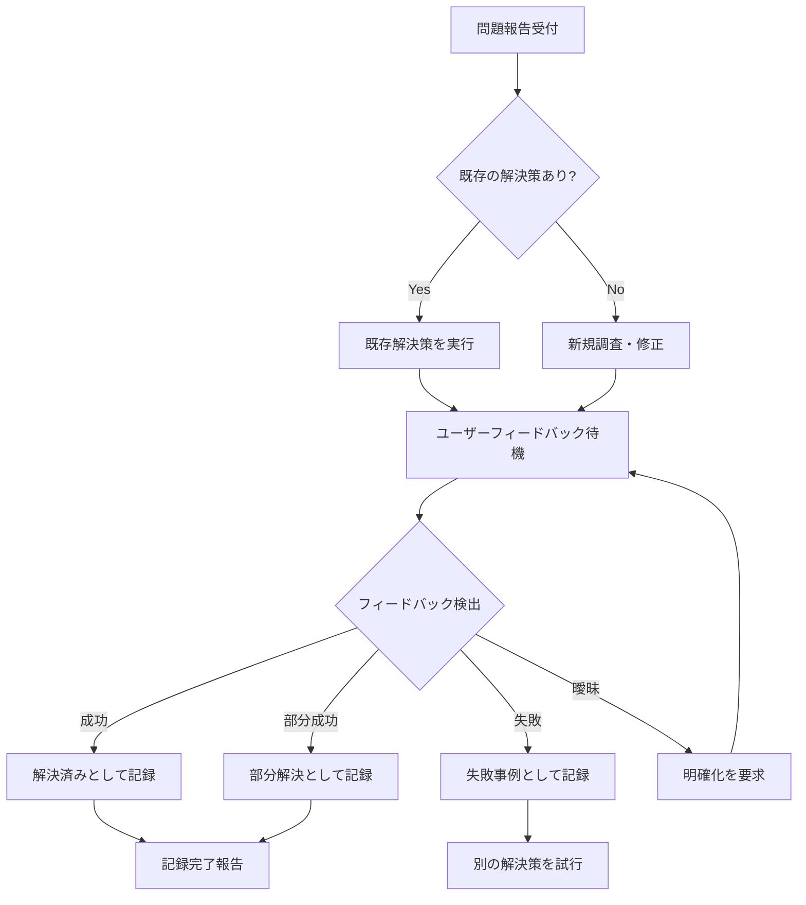
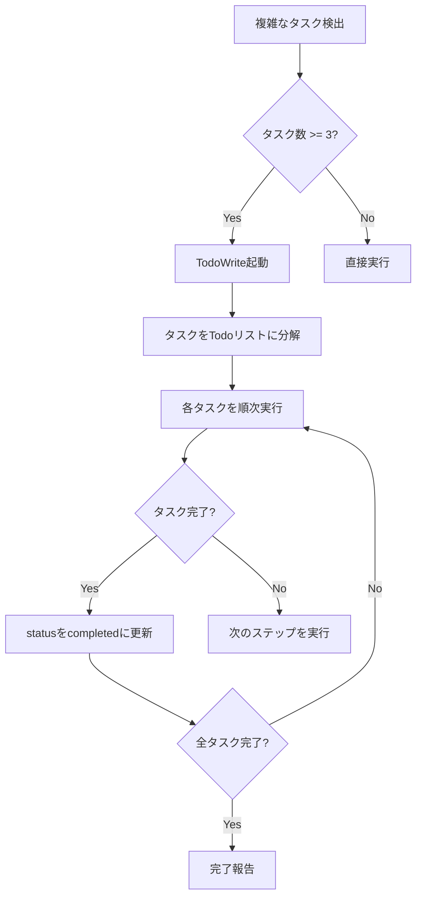
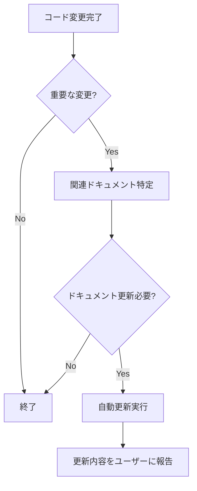
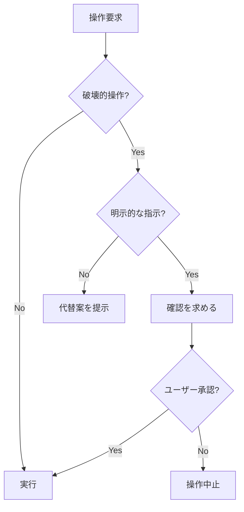

# 🤖 ClaudeCode 自動化アルゴリズム仕様書

## 📋 このドキュメントについて

**目的**: ClaudeCodeの自動化動作の全体像と詳細なアルゴリズムを文書化  
**対象**: 開発者、保守担当者、Claude自身の動作理解  
**最終更新**: 2025-01-27

---

## 🎯 自動化の基本原則

### 1. **プロアクティブだが慎重**
- ユーザーの意図を推測して先回りするが、確認なしに大きな変更はしない
- 明示的な指示がない限り、破壊的な操作（削除、上書き等）は避ける

### 2. **文脈認識と継続性**
- 会話の流れを追跡し、前の作業との関連性を理解
- TodoWriteツールでタスクの進行状況を管理

### 3. **フィードバックループ**
- ユーザーの反応を監視し、それに応じて次の行動を決定
- 成功/失敗を学習材料として記録

---

## 🔄 主要な自動化フロー

### 1. 問題解決自動記録システム



#### トリガーパターン
**✅ 成功パターン**:
- 「できました」「なりました」「解決しました」
- 「うまくいきました」「動きました」「直りました」
- 「正しく表示される」「期待通り」「OK」「良い」

**❌ 失敗パターン**:
- 「できません」「だめです」「うまくいきません」
- 「変わりません」「同じです」「効果なし」
- 「まだずれてる」「直ってない」「NG」

**⚠️ 部分成功パターン**:
- 「一部」「ほぼ」「だいたい」「少し良くなった」
- 「改善したが」「マシになったが」

### 2. タスク管理自動化



#### TodoWrite起動条件
- 3つ以上の独立したステップがある
- ユーザーが複数のタスクをリスト形式で提示
- 「計画」「手順」などのキーワードが含まれる
- 長期的な作業が予想される

### 3. ドキュメント自動更新



#### 更新対象の判定基準
- 新機能の追加
- 既存機能の大幅な変更
- バグ修正（トラブルシューティングに記録）
- API/インターフェースの変更

---

## 🎮 コンテキスト管理

### 1. 会話状態の追跡

```javascript
// 内部的な状態管理（概念的）
const conversationState = {
    currentProblem: null,
    lastAction: null,
    waitingForFeedback: false,
    todoList: [],
    resolvedIssues: [],
    failedAttempts: []
};
```

### 2. 作業継続性の確保

- **中断された作業の再開**: TodoListで未完了タスクを追跡
- **関連作業の認識**: 前の作業との関連性を判断
- **累積的な改善**: 過去の成功/失敗を参照

---

## 🛡️ 安全機構

### 1. 破壊的操作の防止



### 2. エラーハンドリング

- **自動リトライ**: 一時的なエラーは3回まで再試行
- **フォールバック**: 失敗時は安全な代替手段を選択
- **ロールバック**: 問題発生時は変更前の状態に戻す

---

## 📊 判断基準とヒューリスティクス

### 1. 自動実行 vs 確認要求

**自動実行する場合**:
- 読み取り専用の操作
- 可逆的な変更
- ユーザーが明示的に要求した操作
- 小規模な修正（10行以下）

**確認を求める場合**:
- ファイルの削除・上書き
- 大規模な変更（50行以上）
- システム設定の変更
- 外部サービスへの接続

### 2. 優先順位の決定

1. **エラー修正** - 最優先
2. **ユーザーの明示的な要求** - 高優先
3. **改善提案** - 中優先
4. **ドキュメント更新** - 低優先

---

## 🔍 パターン認識

### 1. 問題パターンの識別

```python
# 概念的なパターンマッチング
problem_patterns = {
    "表示問題": ["見えない", "表示されない", "消えた"],
    "位置問題": ["ずれる", "位置がおかしい", "合わない"],
    "サイズ問題": ["大きい", "小さい", "変形"],
    "動作問題": ["動かない", "反応しない", "エラー"]
}
```

### 2. 解決策の選択

1. **既知の問題**: トラブルシューティングDBを参照
2. **類似問題**: パターンマッチングで最も近い解決策を適用
3. **新規問題**: 段階的なデバッグアプローチ

---

## 📈 学習と改善

### 1. フィードバックの蓄積

- **成功事例**: 解決策として記録・再利用
- **失敗事例**: 避けるべきパターンとして記録
- **部分成功**: 改善の余地として記録

### 2. パフォーマンス最適化

- **頻出問題**: 優先的に既存解決策を提示
- **バッチ処理**: 複数の関連タスクをまとめて実行
- **キャッシュ**: 最近の解決策を素早く参照

---

## 🚀 将来の拡張性

### 1. 計画されている機能

- **予測的問題解決**: 問題が発生する前に警告
- **自動テスト実行**: 変更後の回帰テスト
- **パフォーマンス分析**: ボトルネックの自動検出

### 2. 拡張ポイント

- **プラグインシステム**: 新しい自動化ルールの追加
- **カスタムトリガー**: ユーザー定義の自動化条件
- **外部連携**: CI/CDツールとの統合

---

## 📋 実装チェックリスト

### 新しい自動化機能を追加する際の確認事項

- [ ] ユーザーの意図に反しないか
- [ ] 破壊的な操作を含まないか
- [ ] エラーハンドリングは適切か
- [ ] ロールバック可能か
- [ ] ドキュメントは更新されているか
- [ ] テストケースは作成されているか

---

## 🔗 関連ドキュメント

- [📘 CLAUDE.md](../CLAUDE.md) - 基本的な使用方法
- [📋 _TROUBLESHOOTING_RULES.md](./_TROUBLESHOOTING_RULES.md) - 問題記録の自動化ルール
- [📖 DEVELOPMENT_GUIDE.md](./DEVELOPMENT_GUIDE.md) - 開発ガイドライン

---

**💡 重要**: このアルゴリズムは継続的に改善されます。新しいパターンや問題が発見された場合は、このドキュメントを更新してください。