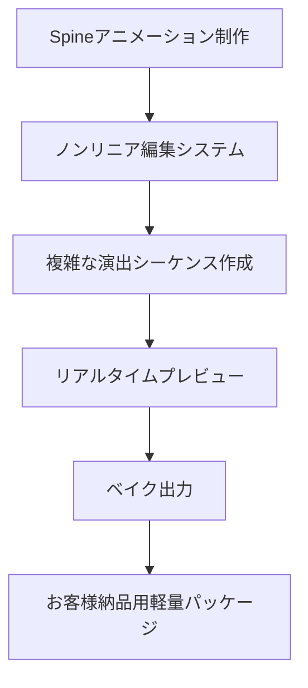
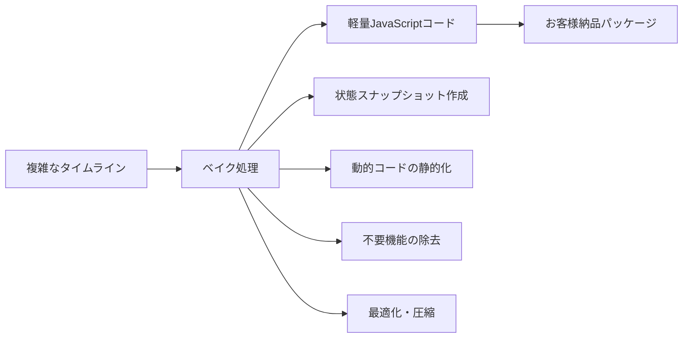

# Spine用ノンリニア編集システム仕様書

**仕様書名**: Spine用ノンリニア編集（Trax風）タイムラインシステム  
**対象環境**: デスクトップアプリ（Electron）  
**作成日**: 2025-08-10  
**最終更新**: 2025-08-10  
**ステータス**: 設計仕様書・実装準備完了

---

## 📋 目次

1. [システム概要・目的](#📊-システム概要・目的)
2. [UI設計（完全独自デザイン）](#🎨-ui設計完全独自デザイン)
3. [技術アーキテクチャ（デスクトップ対応）](#🏗️-技術アーキテクチャデスクトップ対応)
4. [機能詳細仕様](#⚙️-機能詳細仕様)
5. [既存システム統合方法](#🔄-既存システム統合方法)
6. [ベイク出力システム](#📦-ベイク出力システム)
7. [開発計画・Phase分け](#📅-開発計画phase分け)
8. [品質保証・テスト項目](#✅-品質保証テスト項目)

---

## 📊 システム概要・目的

### 🎯 ビジネス目的
**Spineアニメーション制作→納品までの完全ワークフローにおけるタイムライン編集の自動化**



### 💼 商用制作ツールとしての価値
1. **🎨 制作フェーズ**: プロレベルのタイムライン編集（Maya Trax相当）
2. **🔧 調整フェーズ**: 複雑な演出の精密制御
3. **📤 納品フェーズ**: 軽量な再生専用パッケージ出力
4. **✅ 運用フェーズ**: お客様環境での高品質再生

### 📏 技術要件・制約
- **デスクトップアプリ**: Electronベースの独立アプリケーション
- **著作権対応**: Maya TraxやUnityタイムラインを直接模倣しない独自UI
- **軽量性**: 2つのSpineアニメーション + ブレンド領域での基本機能
- **既存統合**: 配置システム（Where）+ タイムライン制御（When）の統合

---

## 🎨 UI設計（完全独自デザイン）

### 🎭 独自デザインコンセプト「Theater Studio」

Maya TraxやUnityタイムラインとは完全に異なる、**劇場・舞台演出**をモチーフとした独自UI設計。

#### **基本レイアウト**
```
┌─────────────────────────────────────────────────────────────────┐
│ 🎭 Theater Studio - Spine Timeline Editor          [File][Edit] │
├─────────────────────────────────────────────────────────────────┤
│ Stage Preview (Spineリアルタイムプレビュー)          │ Cast Panel │
│                                                      │ 🐱ぷらっと │
│  ┌─ Performance Area (600x400) ─┐                   │ 🐭ねずみ   │
│  │                                │                   │ ┌─────────┐ │
│  │   Spine characters preview    │                   │ │Timeline │ │
│  │                                │                   │ │Settings │ │
│  └────────────────────────────────┘                   │ │Panel    │ │
│                                                      │ └─────────┘ │
├─────────────────────────────────────────────────────────────────┤
│ 🎬 Director's Timeline (タイムライン編集エリア)                    │
│ ┌─ Scene Track (シーントラック) ─┐ ┌─ Controls ─┐                │
│ │ Act1│Scene1│Scene2│Scene3    │ │ ▶ ⏸ ⏹ 🔄  │                │
│ └─────────────────────────────────┘ └───────────┘                │
│ ┌─ Character Tracks (キャラクタートラック) ─┐                     │
│ │ 🎭Cast #1  [■■■──■■────■]  Cue Notes                          │
│ │ 🎭Cast #2  [─■■■■──■■■■]  Stage Direction                     │
│ │ 🎭FX       [────■──────■]  Lighting & Effects               │
│ └─────────────────────────────────────────────────────────────┘ │
│ ┌─ Property Inspector (選択中クリップ詳細) ─┐                     │
│ │ Clip: "Walk Action"  Duration: 2.5s     │                     │
│ │ Animation: walk      Blend In: 0.2s     │                     │
│ └───────────────────────────────────────────┘                     │
└─────────────────────────────────────────────────────────────────┘
```

### 🎨 独自UI要素の詳細設計

#### 1. **Stage Preview（舞台プレビューエリア）**
```css
.stage-preview {
    background: linear-gradient(45deg, #1a1a2e, #16213e);
    border: 3px solid #0f3460;
    border-radius: 15px;
    box-shadow: inset 0 0 50px rgba(15, 52, 96, 0.3);
    position: relative;
}

.performance-area {
    width: 600px;
    height: 400px;
    background: radial-gradient(circle at center, #16213e, #1a1a2e);
    border: 1px dashed #0f3460;
    margin: 20px;
}

.stage-lights {
    position: absolute;
    top: 0;
    width: 100%;
    height: 30px;
    background: linear-gradient(90deg, 
        rgba(255,255,255,0.1) 0%,
        rgba(255,255,255,0.05) 50%,
        rgba(255,255,255,0.1) 100%);
}
```

#### 2. **Director's Timeline（演出タイムライン）**
```css
.directors-timeline {
    background: #2d3748;
    border-top: 3px solid #4a5568;
    min-height: 300px;
}

.scene-track {
    height: 40px;
    background: linear-gradient(90deg, #3182ce, #2b77cb);
    border-radius: 8px 8px 0 0;
    display: flex;
    align-items: center;
    color: white;
    font-weight: bold;
}

.scene-marker {
    background: rgba(255,255,255,0.2);
    border: 1px solid rgba(255,255,255,0.4);
    border-radius: 4px;
    padding: 4px 12px;
    margin: 0 5px;
    cursor: pointer;
    transition: all 0.3s;
}

.scene-marker:hover {
    background: rgba(255,255,255,0.3);
    transform: translateY(-2px);
}
```

#### 3. **Character Tracks（キャラクタートラック）**
```css
.character-track {
    height: 60px;
    background: #4a5568;
    border-bottom: 1px solid #2d3748;
    display: flex;
    align-items: center;
    position: relative;
}

.track-label {
    width: 120px;
    padding: 0 15px;
    background: linear-gradient(135deg, #667eea, #764ba2);
    color: white;
    font-weight: bold;
    text-align: center;
    border-radius: 0 15px 15px 0;
}

.track-timeline {
    flex: 1;
    height: 40px;
    background: rgba(0,0,0,0.1);
    border-radius: 5px;
    margin: 0 10px;
    position: relative;
    overflow: hidden;
}

.clip {
    position: absolute;
    height: 30px;
    background: linear-gradient(135deg, #48bb78, #38a169);
    border: 2px solid #68d391;
    border-radius: 6px;
    top: 5px;
    cursor: pointer;
    display: flex;
    align-items: center;
    justify-content: center;
    color: white;
    font-weight: bold;
    font-size: 0.8rem;
    transition: all 0.2s;
}

.clip:hover {
    transform: translateY(-2px);
    box-shadow: 0 4px 12px rgba(72, 187, 120, 0.4);
}

.clip.selected {
    border-color: #ffd700;
    box-shadow: 0 0 15px rgba(255, 215, 0, 0.6);
}
```

#### 4. **Property Inspector（プロパティ検査）**
```css
.property-inspector {
    background: #2d3748;
    border: 2px solid #4a5568;
    border-radius: 10px;
    padding: 15px;
    margin-top: 10px;
}

.property-group {
    margin-bottom: 15px;
    padding-bottom: 10px;
    border-bottom: 1px solid rgba(255,255,255,0.1);
}

.property-label {
    color: #e2e8f0;
    font-weight: bold;
    margin-bottom: 5px;
    font-size: 0.9rem;
}

.property-value {
    background: rgba(255,255,255,0.1);
    border: 1px solid rgba(255,255,255,0.2);
    border-radius: 4px;
    padding: 8px;
    color: white;
    width: 100%;
}

.property-slider {
    width: 100%;
    height: 6px;
    border-radius: 3px;
    background: rgba(255,255,255,0.2);
    outline: none;
}

.property-slider::-webkit-slider-thumb {
    appearance: none;
    width: 18px;
    height: 18px;
    background: linear-gradient(135deg, #667eea, #764ba2);
    border-radius: 50%;
    cursor: pointer;
    box-shadow: 0 2px 6px rgba(0,0,0,0.3);
}
```

### 🎭 独自性確保の設計方針

#### **Maya Trax・Unityタイムラインとの差別化要素**
1. **舞台・劇場モチーフ**: 技術的なUIではなく、芸術的・演出的なUI
2. **独自の色彩設計**: 暗めのステージライティングを模した配色
3. **独自の用語体系**: 
   - Track → Cast（キャスト）
   - Clip → Cue（演技の出番）
   - Timeline → Scene（シーン）
   - Inspector → Stage Direction（演出指示）
4. **独自の操作フロー**: ドラッグ&ドロップよりもダブルクリック・右クリック重視

#### **操作性の独自性**
```javascript
// 独自操作: ダブルクリックでクリップ編集
clip.addEventListener('dblclick', (e) => {
    openStageDirectionDialog(clip);
});

// 独自操作: 右クリックでコンテキストメニュー
track.addEventListener('contextmenu', (e) => {
    e.preventDefault();
    showCastContextMenu(e.clientX, e.clientY);
});

// 独自操作: Space キーで再生・停止（劇場の慣習）
document.addEventListener('keydown', (e) => {
    if (e.code === 'Space') {
        e.preventDefault();
        togglePerformance(); // Play/Pause
    }
});
```

---

## 🏗️ 技術アーキテクチャ（デスクトップ対応）

### 📱 Electronアプリケーション構成

#### **ファイル構造**
```
spine-timeline-studio/
├── main.js                    # Electronメインプロセス
├── preload.js                 # セキュリティブリッジ
├── package.json               # アプリ設定・依存関係
├── renderer/                  # レンダラープロセス（UI）
│   ├── index.html            # メインUI
│   ├── css/
│   │   ├── theater-ui.css    # 独自UI（舞台テーマ）
│   │   └── timeline.css      # タイムライン専用スタイル
│   ├── js/
│   │   ├── timeline-core.js  # タイムライン制御エンジン
│   │   ├── spine-bridge.js   # Spine WebGL統合
│   │   ├── clip-manager.js   # クリップ管理
│   │   ├── export-system.js  # ベイク出力システム
│   │   └── ui-controller.js  # UI制御・イベント管理
│   └── assets/
│       ├── spine/            # Spineファイル（purattokun, nezumi等）
│       └── icons/            # アプリアイコン
└── dist/                     # ビルド出力（配布用）
    ├── spine-timeline-studio.exe  # Windows
    ├── spine-timeline-studio.app  # macOS
    └── spine-timeline-studio       # Linux
```

#### **技術スタック**
```json
{
  "main": "main.js",
  "dependencies": {
    "electron": "^27.0.0",
    "@esotericsoftware/spine-webgl": "4.1.*",
    "file-saver": "^2.0.5",
    "jszip": "^3.10.1"
  },
  "devDependencies": {
    "electron-builder": "^24.6.4",
    "@electron/rebuild": "^3.3.0"
  },
  "build": {
    "appId": "com.example.spine-timeline-studio",
    "productName": "Spine Timeline Studio",
    "directories": {
      "output": "dist"
    },
    "files": [
      "main.js",
      "preload.js", 
      "renderer/**/*"
    ]
  }
}
```

### 🔧 コアエンジン設計

#### **TimelineEngine（タイムライン制御エンジン）**
```javascript
class TheaterTimelineEngine {
    constructor() {
        // 既存システムとの統合
        this.spineIntegration = new SpineBridgeSystem();
        this.coordinateSystem = new UnifiedCoordinateSystem(); // 2層理想構成
        this.boundingBoxSystem = new BoundingBoxPrecisionSystem(); // 34頂点システム
        
        // タイムライン独自システム
        this.scenes = new Map();           // シーン管理
        this.castTracks = new Map();       // キャストトラック
        this.cueClips = new Map();         // キュークリップ
        this.performanceState = {          // 上演状態
            currentTime: 0,
            isPlaying: false,
            totalDuration: 10,
            playbackSpeed: 1.0
        };
        
        // ベイクシステム
        this.bakeSystem = new BakeOutputSystem();
        
        // フレーム制御（60fps基準）
        this.frameRate = 60;
        this.frameTime = 1000 / this.frameRate;
        this.lastFrameTime = 0;
    }
    
    // 既存システム統合API
    initializeWithExistingSystem(spineManager, editSystem) {
        // spine-positioning-system-explanation.js との連携
        // spine-bounds-integration.js との連携
        // 既存の配置システム（Where）+ タイムライン制御（When）
    }
    
    // フレーム精度制御
    updatePerformance(deltaTime) {
        if (!this.performanceState.isPlaying) return;
        
        this.performanceState.currentTime += deltaTime * this.performanceState.playbackSpeed;
        
        // アクティブなキューの実行
        this.executeActiveCues();
        
        // Spine統合システム更新
        this.spineIntegration.updateFrame(this.performanceState.currentTime);
        
        // UI更新通知
        this.notifyTimelineUpdate();
    }
}
```

#### **SpineBridgeSystem（Spine統合システム）**
```javascript
class SpineBridgeSystem {
    constructor() {
        // 既存Spineシステムとの統合
        this.spineCharacterManager = null;  // 既存システム参照
        this.characterStates = new Map();   // キャラクター状態管理
        this.animationQueue = [];           // アニメーション実行キュー
        
        // 統一座標システム適用
        this.coordinateSystem = new UnifiedCoordinateSystem();
        
        // 34頂点境界ボックス統合
        this.boundingBoxSystem = new BoundingBoxPrecisionSystem();
    }
    
    // 既存システム連携
    integrateWithExistingSpineSystem() {
        // window.spineCharacterManager との統合
        // 座標システムの統一
        // 境界ボックスシステムの統合
    }
    
    // アニメーション実行（タイムライン制御）
    executeAnimation(characterId, animationName, blendTime = 0.2) {
        const character = this.characterStates.get(characterId);
        if (!character) return false;
        
        // 既存システムのアニメーション実行
        if (this.spineCharacterManager) {
            this.spineCharacterManager.playAnimation(characterId, animationName);
        }
        
        // タイムライン状態更新
        character.currentAnimation = animationName;
        character.blendTime = blendTime;
        character.startTime = performance.now();
        
        return true;
    }
    
    // ブレンド制御（Unity風クリップブレンド）
    executeBlendedAnimation(characterId, fromAnim, toAnim, blendRatio) {
        // 2つのアニメーション間のブレンド実行
        // blendRatio: 0.0 = fromAnim, 1.0 = toAnim
        
        if (this.spineCharacterManager && this.spineCharacterManager.blendAnimations) {
            this.spineCharacterManager.blendAnimations(
                characterId, 
                fromAnim, 
                toAnim, 
                blendRatio
            );
        }
    }
}
```

### 💾 デスクトップファイル管理

#### **プロジェクトファイル形式**
```json
{
  "project": {
    "name": "Character Performance Scene 1",
    "version": "1.0.0",
    "created": "2025-08-10T12:00:00Z",
    "lastModified": "2025-08-10T15:30:00Z"
  },
  "settings": {
    "frameRate": 60,
    "duration": 15.0,
    "resolution": {
      "width": 800,
      "height": 600
    },
    "exportFormat": "lightweight-html"
  },
  "characters": [
    {
      "id": "purattokun",
      "name": "🐱 ぷらっとくん",
      "spineData": {
        "jsonPath": "assets/spine/characters/purattokun/purattokun.json",
        "atlasPath": "assets/spine/characters/purattokun/purattokun.atlas",
        "texturePath": "assets/spine/characters/purattokun/purattokun.png"
      },
      "position": {
        "x": "35%",
        "y": "75%",
        "scale": 0.55
      }
    }
  ],
  "timeline": {
    "scenes": [
      {
        "id": "scene_1",
        "name": "Opening Scene",
        "startTime": 0,
        "duration": 5.0
      }
    ],
    "tracks": [
      {
        "id": "cast_purattokun",
        "characterId": "purattokun",
        "cues": [
          {
            "id": "cue_1",
            "startTime": 0.0,
            "duration": 2.0,
            "animation": "syutugen",
            "blendIn": 0.2,
            "blendOut": 0.2
          }
        ]
      }
    ]
  }
}
```

#### **Electronファイル操作**
```javascript
// main.js - メインプロセス
const { ipcMain, dialog } = require('electron');
const fs = require('fs').promises;
const path = require('path');

// プロジェクトファイル保存
ipcMain.handle('save-project', async (event, projectData) => {
    const { filePath } = await dialog.showSaveDialog({
        filters: [
            { name: 'Spine Timeline Projects', extensions: ['stp'] }
        ],
        defaultPath: 'untitled.stp'
    });
    
    if (filePath) {
        await fs.writeFile(filePath, JSON.stringify(projectData, null, 2));
        return { success: true, filePath };
    }
    return { success: false };
});

// プロジェクトファイル読み込み
ipcMain.handle('load-project', async (event) => {
    const { filePaths } = await dialog.showOpenDialog({
        filters: [
            { name: 'Spine Timeline Projects', extensions: ['stp'] }
        ],
        properties: ['openFile']
    });
    
    if (filePaths.length > 0) {
        const projectData = await fs.readFile(filePaths[0], 'utf8');
        return { success: true, data: JSON.parse(projectData) };
    }
    return { success: false };
});

// ベイク出力
ipcMain.handle('export-bake', async (event, exportData) => {
    const { filePath } = await dialog.showSaveDialog({
        filters: [
            { name: 'HTML Package', extensions: ['zip'] }
        ],
        defaultPath: 'timeline-export.zip'
    });
    
    if (filePath) {
        const zipBuffer = await createBakePackage(exportData);
        await fs.writeFile(filePath, zipBuffer);
        return { success: true, filePath };
    }
    return { success: false };
});
```

---

## ⚙️ 機能詳細仕様

### 🎬 コア機能

#### 1. **トラック階層構造**
```javascript
class CastTrack {
    constructor(characterId, name) {
        this.id = generateUniqueId();
        this.characterId = characterId;
        this.name = name;                    // "🐱 ぷらっとくん"
        this.cues = [];                      // キュークリップの配列
        this.isExpanded = true;              // 折りたたみ状態
        this.isMuted = false;               // ミュート状態
        this.volume = 1.0;                  // 音量（将来拡張）
        
        // 表示設定
        this.color = this.generateTrackColor();
        this.height = 60;                   // UI高さ
        
        // 統合システム連携
        this.spineIntegration = true;       // Spine連携有効
        this.boundingBoxIntegration = true; // 境界ボックス連携
    }
    
    // キュークリップ追加
    addCue(startTime, duration, animation) {
        const cue = new PerformanceCue({
            startTime,
            duration,
            animation,
            characterId: this.characterId
        });
        
        // 重複チェック・自動調整
        this.adjustForOverlap(cue);
        this.cues.push(cue);
        this.sortCuesByTime();
        
        return cue;
    }
    
    // 重複処理（Unity風自動調整）
    adjustForOverlap(newCue) {
        const overlapping = this.cues.filter(cue => 
            this.isTimeOverlap(cue, newCue)
        );
        
        overlapping.forEach(existingCue => {
            if (newCue.startTime < existingCue.endTime) {
                // 既存クリップをトリム
                existingCue.duration = newCue.startTime - existingCue.startTime;
            }
        });
    }
}

class PerformanceCue {
    constructor(config) {
        this.id = generateUniqueId();
        this.startTime = config.startTime;
        this.duration = config.duration;
        this.animation = config.animation;     // Spineアニメーション名
        this.characterId = config.characterId;
        
        // ブレンド設定
        this.blendIn = 0.2;                   // フェードイン時間
        this.blendOut = 0.2;                  // フェードアウト時間
        this.blendMode = 'crossfade';         // ブレンドモード
        
        // カーブ設定（イージング）
        this.easingCurve = 'easeInOut';
        this.customCurve = null;
        
        // ループ・終了処理
        this.loopCount = 1;                   // ループ回数（1=1回再生）
        this.holdLastFrame = false;           // 最後のフレームを保持
        
        // UI表示
        this.color = this.generateCueColor();
        this.label = this.generateLabel();
        this.selected = false;
    }
    
    get endTime() {
        return this.startTime + this.duration;
    }
    
    // Spineアニメーション実行
    execute(timelineEngine) {
        const character = timelineEngine.spineIntegration.getCharacter(this.characterId);
        if (!character) return false;
        
        // ブレンド実行
        character.playAnimationWithBlend(
            this.animation,
            this.blendIn,
            this.loopCount
        );
        
        return true;
    }
}
```

#### 2. **クリップ操作システム**
```javascript
class ClipManipulationSystem {
    constructor(timelineEngine) {
        this.timeline = timelineEngine;
        this.selectedClips = new Set();
        this.clipboardClips = [];
        
        // 操作状態
        this.isDragging = false;
        this.isResizing = false;
        this.dragStartPos = null;
        this.resizeHandle = null; // 'start' | 'end'
        
        this.setupEventHandlers();
    }
    
    setupEventHandlers() {
        // ダブルクリック：クリップ編集
        this.timeline.ui.addEventListener('dblclick', (e) => {
            const clip = this.getClipAtPosition(e.clientX, e.clientY);
            if (clip) this.openClipEditor(clip);
        });
        
        // 右クリック：コンテキストメニュー
        this.timeline.ui.addEventListener('contextmenu', (e) => {
            e.preventDefault();
            const clip = this.getClipAtPosition(e.clientX, e.clientY);
            this.showContextMenu(e.clientX, e.clientY, clip);
        });
        
        // ドラッグ開始
        this.timeline.ui.addEventListener('mousedown', (e) => {
            const clip = this.getClipAtPosition(e.clientX, e.clientY);
            if (clip) this.startDragOperation(clip, e);
        });
    }
    
    // トリム操作（クリップ端のドラッグ）
    startTrimOperation(clip, handle, startX) {
        this.isResizing = true;
        this.resizeHandle = handle;
        this.activeClip = clip;
        
        const onMouseMove = (e) => {
            const deltaX = e.clientX - startX;
            const deltaTime = this.pixelsToTime(deltaX);
            
            if (handle === 'start') {
                const newStart = Math.max(0, clip.startTime + deltaTime);
                const maxStart = clip.endTime - 0.1; // 最小0.1秒
                clip.startTime = Math.min(newStart, maxStart);
                clip.duration = clip.endTime - clip.startTime;
            } else if (handle === 'end') {
                const newDuration = Math.max(0.1, clip.duration + deltaTime);
                clip.duration = newDuration;
            }
            
            this.timeline.ui.updateClipDisplay(clip);
        };
        
        const onMouseUp = () => {
            document.removeEventListener('mousemove', onMouseMove);
            document.removeEventListener('mouseup', onMouseUp);
            this.isResizing = false;
            this.timeline.ui.redraw();
        };
        
        document.addEventListener('mousemove', onMouseMove);
        document.addEventListener('mouseup', onMouseUp);
    }
    
    // スケール操作（クリップ全体の時間伸縮）
    scaleClip(clip, scaleFactor) {
        const originalDuration = clip.duration;
        clip.duration *= scaleFactor;
        
        // Spineアニメーションの再生速度調整
        clip.playbackSpeed = originalDuration / clip.duration;
        
        this.timeline.ui.updateClipDisplay(clip);
    }
    
    // 複数選択対応
    selectMultipleClips(clips) {
        this.selectedClips.clear();
        clips.forEach(clip => this.selectedClips.add(clip));
        this.timeline.ui.updateSelection(this.selectedClips);
    }
    
    // クリップ編集ダイアログ
    openClipEditor(clip) {
        const editor = new ClipEditorDialog(clip, {
            onSave: (updatedClip) => {
                this.timeline.updateClip(updatedClip);
            },
            onCancel: () => {
                // キャンセル時の処理
            }
        });
        
        editor.show();
    }
}
```

#### 3. **矢印リンク・遷移表示**
```javascript
class TransitionArrowSystem {
    constructor(timelineEngine) {
        this.timeline = timelineEngine;
        this.arrows = new Map();              // クリップ間の矢印
        this.transitionCurves = new Map();    // 遷移カーブ設定
        
        this.canvas = this.createArrowCanvas();
        this.setupArrowRendering();
    }
    
    // 自動矢印生成（隣接するクリップ間）
    generateAutoArrows() {
        this.timeline.castTracks.forEach(track => {
            const sortedCues = track.cues.sort((a, b) => a.startTime - b.startTime);
            
            for (let i = 0; i < sortedCues.length - 1; i++) {
                const fromCue = sortedCues[i];
                const toCue = sortedCues[i + 1];
                
                // 隣接チェック（ギャップが0.5秒以下）
                if (toCue.startTime - fromCue.endTime <= 0.5) {
                    this.createTransitionArrow(fromCue, toCue);
                }
            }
        });
    }
    
    // 遷移矢印作成
    createTransitionArrow(fromCue, toCue, options = {}) {
        const arrow = {
            id: `arrow_${fromCue.id}_${toCue.id}`,
            fromCue,
            toCue,
            
            // 矢印表示設定
            color: options.color || '#ffd700',
            thickness: options.thickness || 3,
            style: options.style || 'curved', // 'straight' | 'curved'
            
            // 遷移設定
            blendTime: options.blendTime || 0.3,
            easing: options.easing || 'easeInOut',
            
            // カーブ設定（Bézier制御点）
            controlPoint1: options.controlPoint1 || { x: 0.3, y: -20 },
            controlPoint2: options.controlPoint2 || { x: 0.7, y: -20 }
        };
        
        this.arrows.set(arrow.id, arrow);
        this.renderArrow(arrow);
        
        return arrow;
    }
    
    // 矢印描画（Canvas）
    renderArrow(arrow) {
        const ctx = this.canvas.getContext('2d');
        const fromPos = this.getClipPosition(arrow.fromCue, 'end');
        const toPos = this.getClipPosition(arrow.toCue, 'start');
        
        ctx.strokeStyle = arrow.color;
        ctx.lineWidth = arrow.thickness;
        ctx.setLineDash([]);
        
        if (arrow.style === 'curved') {
            // ベジェ曲線で描画
            ctx.beginPath();
            ctx.moveTo(fromPos.x, fromPos.y);
            
            const cp1 = {
                x: fromPos.x + (toPos.x - fromPos.x) * arrow.controlPoint1.x,
                y: fromPos.y + arrow.controlPoint1.y
            };
            const cp2 = {
                x: fromPos.x + (toPos.x - fromPos.x) * arrow.controlPoint2.x,
                y: toPos.y + arrow.controlPoint2.y
            };
            
            ctx.bezierCurveTo(cp1.x, cp1.y, cp2.x, cp2.y, toPos.x, toPos.y);
            ctx.stroke();
            
            // 矢印の先端
            this.drawArrowHead(ctx, cp2, toPos, arrow.color);
            
        } else {
            // 直線で描画
            ctx.beginPath();
            ctx.moveTo(fromPos.x, fromPos.y);
            ctx.lineTo(toPos.x, toPos.y);
            ctx.stroke();
            
            this.drawArrowHead(ctx, fromPos, toPos, arrow.color);
        }
    }
    
    // カーブ編集機能
    enableCurveEditing(arrow) {
        const curveEditor = new CurveEditorDialog(arrow, {
            onUpdate: (updatedArrow) => {
                this.arrows.set(updatedArrow.id, updatedArrow);
                this.renderArrow(updatedArrow);
            },
            onSave: (finalArrow) => {
                this.transitionCurves.set(finalArrow.id, finalArrow);
            }
        });
        
        curveEditor.show();
    }
}
```

#### 4. **イベント管理システム**
```javascript
class EventManagementSystem {
    constructor(timelineEngine) {
        this.timeline = timelineEngine;
        this.events = new Map();              // タイムラインイベント
        this.clickEvents = new Map();         // クリックイベント
        this.loopMarkers = new Map();         // ループマーカー
        
        // 重複排除システム
        this.duplicateResolver = new DuplicateEventResolver();
        
        this.setupEventIntegration();
    }
    
    // クリックイベント統合（境界ボックス連携）
    setupEventIntegration() {
        // 既存の境界ボックスシステムと統合
        if (window.boundingBoxSystem) {
            window.boundingBoxSystem.onCharacterClick = (characterId, clickData) => {
                this.handleCharacterClickEvent(characterId, clickData);
            };
        }
    }
    
    // キャラクタークリックイベント処理
    handleCharacterClickEvent(characterId, clickData) {
        const currentTime = this.timeline.performanceState.currentTime;
        
        // クリックイベント作成
        const clickEvent = {
            id: generateUniqueId(),
            type: 'character_click',
            characterId,
            timestamp: currentTime,
            clickPosition: clickData.position,
            boundingZone: clickData.zone,        // 'head', 'body', 'tail' 等
            
            // トリガー設定
            triggerAnimation: this.getClickAnimation(characterId, clickData.zone),
            immediate: true,                     // 即座実行
            interruptCurrent: false              // 現在のアニメーション中断しない
        };
        
        // 重複チェック・実行
        if (!this.duplicateResolver.isDuplicate(clickEvent)) {
            this.executeClickEvent(clickEvent);
            this.events.set(clickEvent.id, clickEvent);
        }
    }
    
    // ループマーカー管理
    addLoopMarker(startTime, endTime, loopCount = -1) {
        const loopMarker = {
            id: generateUniqueId(),
            startTime,
            endTime,
            loopCount,                          // -1 = 無限ループ
            currentLoop: 0,
            isActive: false,
            
            // UI表示
            color: '#ff6b6b',
            label: `Loop ${loopCount === -1 ? '∞' : loopCount}`,
            
            // ループ時の処理
            onLoopStart: () => {
                console.log(`ループ開始: ${startTime}s - ${endTime}s`);
            },
            onLoopEnd: (completed) => {
                console.log(`ループ${completed ? '完了' : '中断'}`);
            }
        };
        
        this.loopMarkers.set(loopMarker.id, loopMarker);
        this.timeline.ui.addLoopMarkerUI(loopMarker);
        
        return loopMarker;
    }
    
    // 重複排除システム
    class DuplicateEventResolver {
        constructor() {
            this.recentEvents = new Map();      // 最近のイベント履歴
            this.timeWindow = 100;              // 重複判定時間窓（ms）
        }
        
        isDuplicate(newEvent) {
            const now = Date.now();
            const key = `${newEvent.type}_${newEvent.characterId}`;
            const recent = this.recentEvents.get(key);
            
            if (recent && (now - recent.timestamp) < this.timeWindow) {
                // 重複として判定
                console.log(`重複イベント検出・無視: ${key}`);
                return true;
            }
            
            // 新規イベントとして記録
            this.recentEvents.set(key, {
                timestamp: now,
                event: newEvent
            });
            
            // 古い履歴をクリーンアップ
            this.cleanupOldEvents(now);
            
            return false;
        }
        
        cleanupOldEvents(currentTime) {
            for (const [key, eventData] of this.recentEvents) {
                if ((currentTime - eventData.timestamp) > this.timeWindow * 5) {
                    this.recentEvents.delete(key);
                }
            }
        }
    }
}
```

---

## 🔄 既存システム統合方法

### 🤝 統合アーキテクチャ

#### **Phase A: 基盤システム連携**
```javascript
class ExistingSystemIntegration {
    constructor() {
        // 既存システム参照
        this.spinePositioningSystem = null;    // spine-positioning-system-explanation.js
        this.boundingBoxSystem = null;         // spine-bounds-integration.js
        this.packageExportSystem = null;       // spine-package-export.js
        this.coordinateSystem = null;          // 統一座標システム
        
        // 統合状態管理
        this.integrationStatus = {
            positioning: false,
            boundingBox: false,
            packageExport: false,
            coordinate: false
        };
        
        this.initializeIntegration();
    }
    
    async initializeIntegration() {
        try {
            // 既存システム検出・初期化待機
            await this.waitForExistingSystems();
            
            // 統一座標システム確立
            this.establishCoordinateSystem();
            
            // 境界ボックス統合
            this.integrateBoundingBoxSystem();
            
            // パッケージ出力システム統合
            this.integratePackageExportSystem();
            
            console.log('✅ 既存システム統合完了', this.integrationStatus);
            
        } catch (error) {
            console.error('❌ 既存システム統合エラー:', error);
            this.setupFallbackMode();
        }
    }
    
    // 既存システム検出待機
    async waitForExistingSystems(timeout = 10000) {
        return new Promise((resolve) => {
            const startTime = Date.now();
            
            const checkSystems = () => {
                // 段階的システム確認
                const systems = {
                    positioning: window.spinePositioningSystem || 
                                window.spinePositioningV2 || 
                                window.SpineEditCore,
                    boundingBox: window.indexBoundsManager || 
                                window.spineSkeletonBounds,
                    packageExport: window.PackageExportSystem ||
                                  window.spinePackageExport,
                    coordinate: window.spineCoordinateUtils ||
                               window.coordinateSystem
                };
                
                // 利用可能システムを記録
                Object.keys(systems).forEach(key => {
                    if (systems[key] && !this.integrationStatus[key]) {
                        this.integrationStatus[key] = true;
                        this[key + 'System'] = systems[key];
                        console.log(`✅ ${key} システム検出完了`);
                    }
                });
                
                // 基本システム（positioning）があれば統合開始
                if (systems.positioning || (Date.now() - startTime) > timeout) {
                    resolve();
                } else {
                    setTimeout(checkSystems, 200);
                }
            };
            
            checkSystems();
        });
    }
    
    // 統一座標システム確立
    establishCoordinateSystem() {
        if (!this.coordinateSystem && this.positioningSystem) {
            // docs/SPINE_BEST_PRACTICES.md 2層理想構成を適用
            this.coordinateSystem = {
                // Layer 1: CSS位置制御
                applyCSSPositioning: (element, x, y, scale) => {
                    element.style.left = x + '%';
                    element.style.top = y + '%';
                    element.style.transform = `translate(-50%, -50%) scale(${scale})`;
                },
                
                // Layer 2: Spine座標制御
                applySpinePositioning: (skeleton, x = 0, y = 0, scale = 0.55) => {
                    skeleton.x = x;
                    skeleton.y = y;
                    skeleton.scaleX = skeleton.scaleY = scale;
                },
                
                // 統合座標変換
                convertCoordinates: (screenX, screenY, canvasRect) => {
                    return {
                        canvasX: screenX - canvasRect.left,
                        canvasY: screenY - canvasRect.top,
                        percentageX: ((screenX - canvasRect.left) / canvasRect.width) * 100,
                        percentageY: ((screenY - canvasRect.top) / canvasRect.height) * 100
                    };
                }
            };
            
            this.integrationStatus.coordinate = true;
        }
    }
    
    // 境界ボックス統合（34頂点精密判定）
    integrateBoundingBoxSystem() {
        if (this.boundingBoxSystem && this.coordinateSystem) {
            // タイムライン制御との統合
            this.timelineBoundingBox = {
                // 精密クリック判定（34頂点）
                handlePrecisionClick: (characterId, clickEvent) => {
                    const boundingResult = this.boundingBoxSystem.checkPrecisionClick(
                        characterId, 
                        clickEvent.clientX, 
                        clickEvent.clientY
                    );
                    
                    if (boundingResult.isInside) {
                        // タイムライン制御に通知
                        this.notifyTimelineClickEvent(characterId, boundingResult);
                    }
                },
                
                // ゾーン別演出制御
                executeZonePerformance: (characterId, zone, performance) => {
                    // 境界ボックスのゾーン情報を使用した演出実行
                    const zoneInfo = this.boundingBoxSystem.getZoneInfo(characterId, zone);
                    
                    if (zoneInfo) {
                        this.executeTimelinePerformance({
                            characterId,
                            zone,
                            performance,
                            zoneData: zoneInfo
                        });
                    }
                },
                
                // 統合座標システムの適用
                coordinateIntegration: {
                    getBoundingBoxCoordinates: (characterId) => {
                        const element = document.getElementById(`${characterId}-canvas`);
                        if (!element) return null;
                        
                        return this.coordinateSystem.convertCoordinates(
                            element.getBoundingClientRect().left,
                            element.getBoundingClientRect().top,
                            element.getBoundingClientRect()
                        );
                    }
                }
            };
            
            console.log('✅ 境界ボックス統合完了');
        }
    }
    
    // パッケージ出力システム統合
    integratePackageExportSystem() {
        if (this.packageExportSystem) {
            this.timelinePackageExport = {
                // タイムライン設定をパッケージに含める
                exportTimelinePackage: async (timelineData, exportOptions = {}) => {
                    const packageData = {
                        // 既存パッケージ機能
                        ...await this.packageExportSystem.generatePackage(),
                        
                        // タイムライン専用データ
                        timeline: {
                            version: '1.0',
                            data: timelineData,
                            playbackSettings: {
                                autoPlay: exportOptions.autoPlay || false,
                                loop: exportOptions.loop || false,
                                controls: exportOptions.showControls || true
                            }
                        }
                    };
                    
                    return this.createTimelinePackage(packageData);
                },
                
                // 軽量プレイヤー生成
                generateLightweightPlayer: (timelineData) => {
                    return `
                    <!-- タイムライン軽量プレイヤー -->
                    <script>
                    class LightweightTimelinePlayer {
                        constructor() {
                            this.timelineData = ${JSON.stringify(timelineData)};
                            this.init();
                        }
                        
                        init() {
                            // 最小限のタイムライン再生機能
                            this.setupBasicPlayback();
                        }
                    }
                    
                    document.addEventListener('DOMContentLoaded', () => {
                        window.timelinePlayer = new LightweightTimelinePlayer();
                    });
                    </script>
                    `;
                }
            };
            
            console.log('✅ パッケージ出力統合完了');
        }
    }
}
```

### 🔧 Where + When 統合

#### **空間制御（Where）+ 時間制御（When）の統合**
```javascript
class SpaceTimeIntegration {
    constructor() {
        this.spaceSystem = null;    // 既存配置システム（Where）
        this.timeSystem = null;     // タイムラインシステム（When）
        this.integratedState = new Map(); // 統合状態管理
    }
    
    // 統合制御API
    setCharacterSpaceTime(characterId, spaceConfig, timeConfig) {
        const character = {
            id: characterId,
            
            // Where: 空間制御
            space: {
                position: {
                    x: spaceConfig.x || '35%',
                    y: spaceConfig.y || '75%'
                },
                scale: spaceConfig.scale || 0.55,
                rotation: spaceConfig.rotation || 0,
                zIndex: spaceConfig.zIndex || 10
            },
            
            // When: 時間制御
            time: {
                timeline: timeConfig.timeline || [],
                currentTime: 0,
                playState: 'stopped',
                loops: timeConfig.loops || 1
            },
            
            // 統合制御
            integration: {
                syncMovement: true,        // 移動の時間同期
                syncAnimation: true,       // アニメーションの時間同期
                boundingBoxUpdate: true,   // 境界ボックスの動的更新
                realTimePreview: true      // リアルタイムプレビュー
            }
        };
        
        this.integratedState.set(characterId, character);
        
        // 両システムに反映
        this.applySpaceConfig(characterId, character.space);
        this.applyTimeConfig(characterId, character.time);
        
        return character;
    }
    
    // リアルタイム統合更新
    updateIntegratedSystem(deltaTime) {
        this.integratedState.forEach((character, characterId) => {
            // 時間軸の更新
            if (character.time.playState === 'playing') {
                character.time.currentTime += deltaTime;
                
                // タイムラインに基づく空間更新
                this.updateSpaceFromTime(characterId, character);
                
                // 境界ボックスの動的更新
                if (character.integration.boundingBoxUpdate) {
                    this.updateBoundingBox(characterId, character);
                }
            }
        });
    }
    
    // タイムラインによる動的な位置制御
    updateSpaceFromTime(characterId, character) {
        const currentCue = this.getCurrentCue(character.time);
        
        if (currentCue && currentCue.spaceModification) {
            // タイムラインで指定された位置・スケール変更
            const newSpace = {
                ...character.space,
                ...currentCue.spaceModification
            };
            
            this.applySpaceConfig(characterId, newSpace);
            character.space = newSpace;
        }
    }
}
```

---

## 📦 ベイク出力システム

### 🏭 ベイク処理アーキテクチャ

#### **概念: Timeline → Lightweight Player**


#### **ベイクエンジン実装**
```javascript
class TimelineBakeEngine {
    constructor(timelineData, exportOptions = {}) {
        this.timelineData = timelineData;
        this.options = {
            includeEditor: false,           // エディター機能を含めない
            optimize: true,                 // 最適化実行
            minify: true,                   // コード圧縮
            includeDebugInfo: false,        // デバッグ情報除去
            targetFrameRate: 60,            // 対象フレームレート
            ...exportOptions
        };
        
        this.bakeResults = new Map();       // ベイク結果
        this.optimizationStats = {};       // 最適化統計
    }
    
    // メインベイク処理
    async bakeTimeline() {
        console.log('🔥 タイムラインベイク処理開始');
        
        try {
            // Phase 1: データ解析・最適化
            const optimizedData = await this.optimizeTimelineData();
            
            // Phase 2: 軽量プレイヤー生成
            const lightweightPlayer = await this.generateLightweightPlayer(optimizedData);
            
            // Phase 3: 静的アセット処理
            const staticAssets = await this.processStaticAssets();
            
            // Phase 4: パッケージ生成
            const finalPackage = await this.createFinalPackage({
                player: lightweightPlayer,
                assets: staticAssets,
                data: optimizedData
            });
            
            this.bakeResults.set('final', finalPackage);
            
            console.log('✅ タイムラインベイク処理完了', {
                originalSize: this.calculateOriginalSize(),
                bakedSize: finalPackage.size,
                compressionRatio: this.getCompressionRatio()
            });
            
            return finalPackage;
            
        } catch (error) {
            console.error('❌ ベイク処理エラー:', error);
            throw error;
        }
    }
    
    // データ最適化
    async optimizeTimelineData() {
        const optimized = {
            version: '1.0-baked',
            bakedAt: Date.now(),
            
            // 最適化されたタイムラインデータ
            timeline: {
                duration: this.timelineData.timeline.duration,
                frameRate: this.options.targetFrameRate,
                
                // キーフレームの事前計算
                precomputedFrames: this.precomputeKeyframes(),
                
                // 簡略化されたトラックデータ
                tracks: this.simplifyTracks(this.timelineData.timeline.tracks),
                
                // 最適化されたアニメーション情報
                animations: this.optimizeAnimationData()
            },
            
            // 簡略化されたキャラクター情報
            characters: this.optimizeCharacterData(this.timelineData.characters),
            
            // 実行時設定
            runtime: {
                autoPlay: this.options.autoPlay,
                loop: this.options.loop,
                showControls: this.options.showControls,
                
                // パフォーマンス最適化設定
                useRequestAnimationFrame: true,
                batchUpdates: true,
                optimizedRendering: true
            }
        };
        
        return optimized;
    }
    
    // キーフレーム事前計算
    precomputeKeyframes() {
        const frames = new Map();
        const frameCount = Math.ceil(this.timelineData.timeline.duration * this.options.targetFrameRate);
        
        for (let frame = 0; frame < frameCount; frame++) {
            const time = frame / this.options.targetFrameRate;
            const frameData = this.calculateFrameState(time);
            frames.set(frame, frameData);
        }
        
        console.log(`📊 キーフレーム事前計算完了: ${frameCount}フレーム`);
        return Array.from(frames.entries());
    }
    
    // 軽量プレイヤー生成
    async generateLightweightPlayer(optimizedData) {
        const playerCode = `
        /**
         * Spine Timeline Lightweight Player
         * Generated: ${new Date().toISOString()}
         * Baked from timeline data - DO NOT EDIT MANUALLY
         */
        class SpineTimelineLightweightPlayer {
            constructor(containerElement) {
                this.container = containerElement;
                this.data = ${JSON.stringify(optimizedData, null, 2)};
                this.state = {
                    currentFrame: 0,
                    isPlaying: false,
                    startTime: 0,
                    lastFrameTime: 0
                };
                
                this.characters = new Map();
                this.animationFrameId = null;
                
                this.init();
            }
            
            init() {
                this.setupContainer();
                this.loadCharacters();
                this.setupControls();
                
                if (this.data.runtime.autoPlay) {
                    this.play();
                }
            }
            
            setupContainer() {
                this.container.className = 'spine-timeline-player';
                this.container.innerHTML = \`
                    <div class="player-stage" style="
                        position: relative;
                        width: 100%;
                        height: 400px;
                        background: linear-gradient(45deg, #1a1a2e, #16213e);
                        border-radius: 10px;
                        overflow: hidden;
                    ">
                        <div class="characters-container"></div>
                        <div class="player-controls" style="
                            position: absolute;
                            bottom: 10px;
                            left: 50%;
                            transform: translateX(-50%);
                            background: rgba(0,0,0,0.8);
                            padding: 10px;
                            border-radius: 20px;
                            display: \${this.data.runtime.showControls ? 'flex' : 'none'};
                            gap: 10px;
                            align-items: center;
                        ">
                            <button class="play-btn">▶️</button>
                            <button class="pause-btn" style="display: none;">⏸️</button>
                            <button class="stop-btn">⏹️</button>
                            <div class="progress-bar" style="
                                width: 200px;
                                height: 6px;
                                background: rgba(255,255,255,0.3);
                                border-radius: 3px;
                                position: relative;
                            ">
                                <div class="progress-fill" style="
                                    height: 100%;
                                    background: #667eea;
                                    border-radius: 3px;
                                    width: 0%;
                                    transition: width 0.1s;
                                "></div>
                            </div>
                        </div>
                    </div>
                \`;
            }
            
            loadCharacters() {
                const charactersContainer = this.container.querySelector('.characters-container');
                
                this.data.characters.forEach(characterData => {
                    const characterElement = this.createCharacterElement(characterData);
                    charactersContainer.appendChild(characterElement);
                    this.characters.set(characterData.id, {
                        element: characterElement,
                        data: characterData,
                        currentAnimation: null
                    });
                });
            }
            
            createCharacterElement(characterData) {
                const element = document.createElement('canvas');
                element.id = characterData.id + '-canvas';
                element.width = 200;
                element.height = 200;
                element.style.cssText = \`
                    position: absolute;
                    left: \${characterData.position.x};
                    top: \${characterData.position.y};
                    transform: translate(-50%, -50%) scale(\${characterData.position.scale});
                    z-index: \${characterData.position.zIndex || 10};
                \`;
                
                // Spine WebGL初期化（軽量版）
                this.initializeLightweightSpine(element, characterData);
                
                return element;
            }
            
            initializeLightweightSpine(canvas, characterData) {
                // 軽量Spine初期化（必要最小限）
                if (window.spine && characterData.spineData) {
                    // ここで最小限のSpine WebGL設定
                    // ベイク時に必要なアニメーションのみ読み込み
                }
            }
            
            play() {
                this.state.isPlaying = true;
                this.state.startTime = performance.now();
                this.state.lastFrameTime = this.state.startTime;
                
                this.updatePlayButton();
                this.animateFrame();
            }
            
            pause() {
                this.state.isPlaying = false;
                if (this.animationFrameId) {
                    cancelAnimationFrame(this.animationFrameId);
                }
                this.updatePlayButton();
            }
            
            stop() {
                this.pause();
                this.state.currentFrame = 0;
                this.updateFrame(0);
                this.updateProgress(0);
            }
            
            animateFrame() {
                if (!this.state.isPlaying) return;
                
                const now = performance.now();
                const elapsed = now - this.state.startTime;
                const targetFrame = Math.floor(elapsed / 1000 * this.data.timeline.frameRate);
                
                if (targetFrame !== this.state.currentFrame) {
                    this.state.currentFrame = targetFrame;
                    this.updateFrame(targetFrame);
                    this.updateProgress(targetFrame);
                }
                
                // 終了チェック
                if (targetFrame >= this.data.timeline.precomputedFrames.length) {
                    if (this.data.runtime.loop) {
                        this.state.startTime = now;
                        this.state.currentFrame = 0;
                    } else {
                        this.stop();
                        return;
                    }
                }
                
                this.animationFrameId = requestAnimationFrame(() => this.animateFrame());
            }
            
            updateFrame(frameIndex) {
                const frameData = this.data.timeline.precomputedFrames[frameIndex];
                if (!frameData) return;
                
                const [frame, state] = frameData;
                
                // 各キャラクターの状態更新
                Object.entries(state.characters).forEach(([characterId, characterState]) => {
                    const character = this.characters.get(characterId);
                    if (character && characterState.animation !== character.currentAnimation) {
                        this.executeAnimation(characterId, characterState.animation);
                        character.currentAnimation = characterState.animation;
                    }
                });
            }
            
            executeAnimation(characterId, animationName) {
                const character = this.characters.get(characterId);
                if (!character) return;
                
                // 軽量アニメーション実行
                // （実際のSpine WebGL呼び出しまたは代替アニメーション）
                console.log(\`\${characterId}: \${animationName}\`);
            }
            
            updateProgress(frame) {
                const progress = (frame / this.data.timeline.precomputedFrames.length) * 100;
                const progressFill = this.container.querySelector('.progress-fill');
                if (progressFill) {
                    progressFill.style.width = progress + '%';
                }
            }
            
            updatePlayButton() {
                const playBtn = this.container.querySelector('.play-btn');
                const pauseBtn = this.container.querySelector('.pause-btn');
                
                if (this.state.isPlaying) {
                    playBtn.style.display = 'none';
                    pauseBtn.style.display = 'inline-block';
                } else {
                    playBtn.style.display = 'inline-block';
                    pauseBtn.style.display = 'none';
                }
            }
            
            setupControls() {
                const playBtn = this.container.querySelector('.play-btn');
                const pauseBtn = this.container.querySelector('.pause-btn');
                const stopBtn = this.container.querySelector('.stop-btn');
                
                playBtn.addEventListener('click', () => this.play());
                pauseBtn.addEventListener('click', () => this.pause());
                stopBtn.addEventListener('click', () => this.stop());
            }
        }
        
        // 自動初期化
        document.addEventListener('DOMContentLoaded', () => {
            const container = document.getElementById('spine-timeline-container') || 
                           document.querySelector('.spine-timeline-player-container') ||
                           document.body;
                           
            if (container) {
                window.spineTimelinePlayer = new SpineTimelineLightweightPlayer(container);
            }
        });
        `;
        
        return {
            code: playerCode,
            size: playerCode.length,
            minified: this.options.minify ? this.minifyCode(playerCode) : playerCode
        };
    }
    
    // 最終パッケージ作成
    async createFinalPackage(components) {
        const package = {
            type: 'spine-timeline-baked-package',
            version: '1.0',
            createdAt: new Date().toISOString(),
            
            // メインファイル
            files: {
                'index.html': this.generateIndexHTML(components),
                'timeline-player.js': components.player.minified || components.player.code,
                'timeline-data.json': JSON.stringify(components.data),
                'styles.css': this.generateStyles()
            },
            
            // アセット
            assets: components.assets,
            
            // メタ情報
            metadata: {
                originalTimelineDuration: this.timelineData.timeline.duration,
                totalFrames: components.data.timeline.precomputedFrames.length,
                characterCount: this.timelineData.characters.length,
                
                // 最適化統計
                optimization: {
                    originalSize: this.calculateOriginalSize(),
                    bakedSize: this.calculateBakedSize(components),
                    compressionRatio: this.getCompressionRatio(),
                    precomputedFrames: components.data.timeline.precomputedFrames.length
                }
            }
        };
        
        return package;
    }
    
    // HTMLテンプレート生成
    generateIndexHTML(components) {
        return `<!DOCTYPE html>
<html lang="ja">
<head>
    <meta charset="UTF-8">
    <meta name="viewport" content="width=device-width, initial-scale=1.0">
    <title>Spine Timeline - Baked Performance</title>
    <link rel="stylesheet" href="styles.css">
    ${this.generateSpineWebGLScript()}
</head>
<body>
    <div id="spine-timeline-container" class="spine-timeline-player-container">
        <!-- タイムラインプレイヤーがここに生成されます -->
    </div>
    
    <script src="timeline-player.js"></script>
</body>
</html>`;
    }
    
    // Spine WebGL CDN/ローカル判定
    generateSpineWebGLScript() {
        if (this.options.includeSpineLocal) {
            return '<script src="assets/spine-webgl.js"></script>';
        } else {
            return '<script src="https://unpkg.com/@esotericsoftware/spine-webgl@4.1.*/dist/iife/spine-webgl.js"></script>';
        }
    }
}
```

### 📊 最適化統計・レポート

#### **ベイク処理の効果測定**
```javascript
class BakeOptimizationReporter {
    constructor(originalData, bakedData) {
        this.original = originalData;
        this.baked = bakedData;
        this.stats = this.calculateStats();
    }
    
    calculateStats() {
        return {
            fileSize: {
                original: this.calculateOriginalSize(),
                baked: this.calculateBakedSize(),
                reduction: this.calculateSizeReduction()
            },
            
            functionality: {
                originalFeatures: this.countOriginalFeatures(),
                bakedFeatures: this.countBakedFeatures(),
                removedFeatures: this.listRemovedFeatures()
            },
            
            performance: {
                loadTime: {
                    estimated: this.estimateLoadTime(),
                    improvement: this.estimateLoadTimeImprovement()
                },
                runtime: {
                    memoryUsage: this.estimateMemoryUsage(),
                    cpuUsage: this.estimateCpuUsage()
                }
            },
            
            compatibility: {
                browserSupport: this.checkBrowserSupport(),
                mobileOptimization: this.checkMobileOptimization()
            }
        };
    }
    
    generateReport() {
        const report = `
# Spine Timeline Bake Report
Generated: ${new Date().toISOString()}

## File Size Optimization
- Original: ${(this.stats.fileSize.original / 1024).toFixed(2)} KB
- Baked: ${(this.stats.fileSize.baked / 1024).toFixed(2)} KB
- Reduction: ${this.stats.fileSize.reduction.toFixed(1)}%

## Feature Summary
- Original Features: ${this.stats.functionality.originalFeatures}
- Baked Features: ${this.stats.functionality.bakedFeatures}
- Removed Features: ${this.stats.functionality.removedFeatures.join(', ')}

## Performance Estimates
- Load Time Improvement: ${this.stats.performance.loadTime.improvement.toFixed(1)}%
- Memory Usage: ${(this.stats.performance.runtime.memoryUsage / 1024).toFixed(2)} MB
- CPU Usage: ${this.stats.performance.runtime.cpuUsage.toFixed(1)}%

## Compatibility
- Browser Support: ${this.stats.compatibility.browserSupport}
- Mobile Optimized: ${this.stats.compatibility.mobileOptimization ? 'Yes' : 'No'}

## Recommendations
${this.generateRecommendations()}
        `;
        
        return report;
    }
    
    generateRecommendations() {
        const recommendations = [];
        
        if (this.stats.fileSize.reduction < 50) {
            recommendations.push('- Consider enabling more aggressive optimization options');
        }
        
        if (this.stats.performance.runtime.memoryUsage > 10 * 1024 * 1024) {
            recommendations.push('- Consider reducing precomputed frame data for better memory usage');
        }
        
        if (!this.stats.compatibility.mobileOptimization) {
            recommendations.push('- Enable mobile optimization for better mobile device performance');
        }
        
        return recommendations.length > 0 ? recommendations.join('\n') : '- Current configuration is optimal';
    }
}
```

---

## 📅 開発計画・Phase分け

### 🎯 Phase構成（品質保証統合版）

#### **Phase 1: 基盤システム構築**（4-5週間）
**目標**: デスクトップアプリ基盤 + 基本タイムライン機能

**Week 1-2: デスクトップアプリ基盤**
- [ ] Electronアプリケーション基本構造構築
- [ ] 独自UI（Theater Studio）基本レイアウト実装
- [ ] ファイル管理システム（プロジェクト保存・読み込み）
- [ ] 既存システム統合API設計

**Week 3-4: 基本タイムライン機能**
- [ ] TimelineEngine基本クラス実装（500行以内）
- [ ] キャラクタートラック・クリップ管理（400行以内）
- [ ] 基本再生・停止制御（300行以内）
- [ ] Spine WebGL統合基盤（350行以内）

**完了基準**:
- [ ] アプリの基本起動・終了
- [ ] プロジェクトの保存・読み込み
- [ ] 2つのSpineキャラクターの読み込み・表示
- [ ] 基本的なタイムライン再生
- **品質基準**: 全ファイル500行以下・複雑度10以下

#### **Phase 2: 編集機能実装**（3-4週間）
**目標**: プロレベルのタイムライン編集機能

**Week 1-2: クリップ操作システム**
- [ ] ドラッグ&ドロップによるクリップ移動（400行以内）
- [ ] トリム・スケール操作（350行以内）
- [ ] 複数選択・一括操作（300行以内）
- [ ] クリップ編集ダイアログ（250行以内）

**Week 3-4: 高度編集機能**
- [ ] 矢印リンク・遷移表示システム（450行以内）
- [ ] カーブ編集機能（300行以内）
- [ ] キーボードショートカット（200行以内）
- [ ] Undo/Redo機能（350行以内）

**完了基準**:
- [ ] 直感的なクリップ編集操作
- [ ] 複雑なタイムライン構築
- [ ] 編集操作のUndo/Redo
- [ ] キーボードショートカット対応
- **品質基準**: UI応答性100ms以下・編集操作の確実性

#### **Phase 3: 統合・連携システム**（2-3週間）
**目標**: 既存システムとの完全統合

**Week 1-2: 既存システム統合**
- [ ] 統一座標システム完全適用（400行以内）
- [ ] 境界ボックス精密判定統合（350行以内）
- [ ] 配置システム（Where）連携（300行以内）
- [ ] イベント管理システム統合（450行以内）

**Week 2-3: リアルタイムプレビュー**
- [ ] Stage Preview エリア実装（350行以内）
- [ ] リアルタイム状態同期（300行以内）
- [ ] パフォーマンス最適化（250行以内）

**完了基準**:
- [ ] 既存システムとの完全統合動作
- [ ] リアルタイムプレビューの確実動作
- [ ] 境界ボックス・クリック判定の統合
- **品質基準**: 統合での機能破損なし・60fps安定動作

#### **Phase 4: ベイク出力システム**（2-3週間）
**目標**: 商用納品レベルのパッケージ出力

**Week 1-2: ベイクエンジン実装**
- [ ] タイムライン最適化システム（500行以内）
- [ ] 軽量プレイヤー生成（400行以内）
- [ ] 静的アセット処理（300行以内）
- [ ] パッケージ作成システム（350行以内）

**Week 2-3: 出力品質保証**
- [ ] 出力パッケージ検証システム（250行以内）
- [ ] ブラウザ互換性テスト自動化（200行以内）
- [ ] 最適化レポート生成（200行以内）
- [ ] エラーハンドリング・ロバストネス（300行以内）

**完了基準**:
- [ ] 完全動作するパッケージ出力
- [ ] お客様納品レベルの品質
- [ ] 50%以上のファイルサイズ削減
- [ ] 主要ブラウザ完全対応
- **品質基準**: 出力成功率99%以上・品質保証完全自動化

### 📊 品質管理KPI

#### **開発品質KPI**
- **ファイルサイズ管理**: 500行以下維持率 **95%以上**
- **関数サイズ管理**: 50行以下維持率 **90%以上**
- **複雑度管理**: 循環複雑度10以下維持率 **85%以上**
- **テスト網羅率**: 単体・統合テスト網羅率 **90%以上**

#### **ユーザー体験KPI**
- **操作応答性**: UI操作レスポンス **100ms以内**
- **安定性**: アプリクラッシュ率 **0.1%以下**
- **パフォーマンス**: タイムライン再生 **60fps安定**
- **出力品質**: ベイクパッケージ動作成功率 **99%以上**

#### **商用品質KPI**
- **ファイルサイズ削減**: ベイク出力で **50%以上削減**
- **ロード時間改善**: お客様環境でのロード時間 **3秒以内**
- **ブラウザ対応**: 主要ブラウザ（Chrome、Firefox、Safari、Edge）**完全対応**
- **モバイル対応**: スマートフォン・タブレットでの **完全動作**

### 🔄 品質保証プロセス

#### **Phase毎の必須チェックリスト**
```javascript
// 品質チェック自動化
class QualityAssuranceSystem {
    runPhaseCheck(phase) {
        const checks = {
            codeQuality: this.checkCodeQuality(),
            performance: this.checkPerformance(),
            functionality: this.checkFunctionality(),
            integration: this.checkIntegration(),
            userExperience: this.checkUserExperience()
        };
        
        const passedChecks = Object.values(checks).filter(check => check.passed).length;
        const totalChecks = Object.keys(checks).length;
        const qualityScore = (passedChecks / totalChecks) * 100;
        
        console.log(`Phase ${phase} 品質スコア: ${qualityScore}%`);
        
        return {
            phase,
            qualityScore,
            checks,
            readyForNext: qualityScore >= 95
        };
    }
    
    checkCodeQuality() {
        // ファイルサイズ・複雑度・命名規則チェック
        return {
            passed: this.isCodeQualityAcceptable(),
            metrics: this.getCodeQualityMetrics(),
            recommendations: this.getCodeQualityRecommendations()
        };
    }
    
    checkPerformance() {
        // フレームレート・メモリ使用量・レスポンス時間チェック
        return {
            passed: this.isPerformanceAcceptable(),
            metrics: this.getPerformanceMetrics(),
            recommendations: this.getPerformanceRecommendations()
        };
    }
}
```

---

## ✅ 品質保証・テスト項目

### 🧪 テスト戦略

#### **1. 単体テスト（Unit Tests）**
```javascript
// テスト例: TimelineEngine
describe('TimelineEngine', () => {
    let engine;
    
    beforeEach(() => {
        engine = new TheaterTimelineEngine();
    });
    
    test('基本初期化', () => {
        expect(engine).toBeDefined();
        expect(engine.performanceState.currentTime).toBe(0);
        expect(engine.performanceState.isPlaying).toBe(false);
    });
    
    test('キャラクター追加', () => {
        const character = engine.addCharacter('purattokun', {
            spineData: mockSpineData,
            position: { x: '35%', y: '75%' }
        });
        
        expect(engine.characters.has('purattokun')).toBe(true);
        expect(character.id).toBe('purattokun');
    });
    
    test('タイムライン再生', (done) => {
        engine.addCharacter('purattokun', mockSpineData);
        engine.addCue('purattokun', 0, 2, 'syutugen');
        
        engine.play();
        expect(engine.performanceState.isPlaying).toBe(true);
        
        setTimeout(() => {
            expect(engine.performanceState.currentTime).toBeGreaterThan(0);
            done();
        }, 100);
    });
});
```

#### **2. 統合テスト（Integration Tests）**
```javascript
describe('既存システム統合', () => {
    test('境界ボックス統合', async () => {
        const integrationSystem = new ExistingSystemIntegration();
        await integrationSystem.initializeIntegration();
        
        expect(integrationSystem.integrationStatus.boundingBox).toBe(true);
        
        // 精密クリック判定テスト
        const clickResult = integrationSystem.timelineBoundingBox.handlePrecisionClick(
            'purattokun', 
            { clientX: 100, clientY: 100 }
        );
        
        expect(clickResult).toBeDefined();
    });
    
    test('パッケージ出力統合', async () => {
        const timelineData = mockTimelineData;
        const packageResult = await integrationSystem.timelinePackageExport.exportTimelinePackage(timelineData);
        
        expect(packageResult.success).toBe(true);
        expect(packageResult.package).toBeDefined();
        expect(packageResult.package.files).toHaveProperty('index.html');
        expect(packageResult.package.files).toHaveProperty('timeline-player.js');
    });
});
```

#### **3. E2Eテスト（End-to-End Tests）**
```javascript
// Electronアプリテスト（Spectron使用想定）
describe('Electronアプリケーション', () => {
    let app;
    
    beforeEach(async () => {
        app = new Application({
            path: electronPath,
            args: [path.join(__dirname, '..', 'main.js')]
        });
        await app.start();
    });
    
    afterEach(async () => {
        if (app && app.isRunning()) {
            await app.stop();
        }
    });
    
    test('アプリケーション起動', async () => {
        const windowCount = await app.client.getWindowCount();
        expect(windowCount).toBe(1);
        
        const title = await app.client.getTitle();
        expect(title).toBe('Spine Timeline Studio');
    });
    
    test('プロジェクト作成・保存', async () => {
        // 新規プロジェクト作成
        await app.client.click('#new-project');
        
        // キャラクター追加
        await app.client.click('#add-character');
        await app.client.setValue('#character-selector', 'purattokun');
        
        // タイムライン編集
        await app.client.click('#timeline-area');
        await app.client.dragAndDrop('#character-clip', '#timeline-track');
        
        // 保存
        await app.client.click('#save-project');
        
        const saveDialog = await app.client.isExisting('.save-dialog');
        expect(saveDialog).toBe(true);
    });
    
    test('ベイク出力', async () => {
        // プロジェクト読み込み
        await app.client.click('#load-project');
        // ファイル選択は実際のテストでは別途対応
        
        // ベイク実行
        await app.client.click('#export-bake');
        
        // 出力設定
        await app.client.click('#optimize-output');
        await app.client.click('#confirm-export');
        
        // 完了確認
        await app.client.waitForExist('.export-success', 10000);
        const successMessage = await app.client.getText('.export-success');
        expect(successMessage).toContain('エクスポート完了');
    });
});
```

### 🔍 品質検証項目

#### **機能品質チェックリスト**
- [ ] **基本機能**
  - [ ] アプリケーション起動・終了
  - [ ] プロジェクト作成・保存・読み込み
  - [ ] キャラクター追加・削除
  - [ ] タイムライン再生・停止・一時停止
  
- [ ] **編集機能**
  - [ ] クリップドラッグ・ドロップ
  - [ ] トリム・スケール操作
  - [ ] 複数選択・一括操作
  - [ ] Undo/Redo機能
  
- [ ] **統合機能**
  - [ ] 既存システムとの連携
  - [ ] 境界ボックス統合
  - [ ] リアルタイムプレビュー
  - [ ] イベント管理
  
- [ ] **出力機能**
  - [ ] ベイクパッケージ生成
  - [ ] 軽量プレイヤー動作
  - [ ] ブラウザ互換性
  - [ ] モバイル対応

#### **性能品質チェックリスト**
- [ ] **レスポンス性能**
  - [ ] UI操作レスポンス < 100ms
  - [ ] タイムライン更新 < 16ms (60fps)
  - [ ] ファイル保存 < 1s
  - [ ] ベイク出力 < 30s（10分プロジェクト）
  
- [ ] **メモリ・CPU効率**
  - [ ] アイドル時メモリ使用量 < 200MB
  - [ ] 編集時メモリ使用量 < 500MB
  - [ ] CPU使用率（通常時）< 20%
  - [ ] CPU使用率（ベイク時）< 80%
  
- [ ] **ファイルサイズ効率**
  - [ ] プロジェクトファイル < 1MB（10分プロジェクト）
  - [ ] ベイク出力削減率 > 50%
  - [ ] 軽量プレイヤー < 100KB
  - [ ] 出力HTMLパッケージ < 2MB

#### **互換性・安定性チェックリスト**
- [ ] **プラットフォーム対応**
  - [ ] Windows 10/11
  - [ ] macOS (Intel/Apple Silicon)
  - [ ] Linux (Ubuntu/CentOS)
  
- [ ] **ブラウザ対応（出力）**
  - [ ] Chrome（最新・1つ前）
  - [ ] Firefox（最新・1つ前）
  - [ ] Safari（最新・1つ前）
  - [ ] Edge（最新・1つ前）
  
- [ ] **デバイス対応（出力）**
  - [ ] デスクトップ（1920x1080以上）
  - [ ] ラップトップ（1366x768以上）
  - [ ] タブレット（768x1024以上）
  - [ ] スマートフォン（375x667以上）
  
- [ ] **安定性基準**
  - [ ] クラッシュ率 < 0.1%
  - [ ] メモリリークなし
  - [ ] データ破損なし
  - [ ] 24時間連続動作

### 📊 品質メトリクス監視

#### **自動品質監視システム**
```javascript
class QualityMonitoringSystem {
    constructor() {
        this.metrics = new Map();
        this.thresholds = {
            responseTime: 100,      // ms
            memoryUsage: 500,       // MB
            cpuUsage: 20,          // %
            errorRate: 0.1,        // %
            codeComplexity: 10,    // Cyclomatic complexity
            fileSize: 500          // lines
        };
        
        this.startMonitoring();
    }
    
    startMonitoring() {
        // リアルタイム監視
        setInterval(() => {
            this.collectMetrics();
            this.checkThresholds();
        }, 5000);
        
        // 日次レポート
        setInterval(() => {
            this.generateDailyReport();
        }, 24 * 60 * 60 * 1000);
    }
    
    collectMetrics() {
        const metrics = {
            timestamp: Date.now(),
            responseTime: this.measureResponseTime(),
            memoryUsage: this.measureMemoryUsage(),
            cpuUsage: this.measureCpuUsage(),
            errorRate: this.calculateErrorRate(),
            userActions: this.countUserActions()
        };
        
        this.metrics.set(metrics.timestamp, metrics);
        
        // メトリクス履歴制限
        this.limitMetricsHistory();
    }
    
    checkThresholds() {
        const latest = Array.from(this.metrics.values()).slice(-1)[0];
        
        Object.entries(this.thresholds).forEach(([metric, threshold]) => {
            if (latest[metric] > threshold) {
                this.alertThresholdViolation(metric, latest[metric], threshold);
            }
        });
    }
    
    generateQualityReport() {
        const recent = Array.from(this.metrics.values()).slice(-100);
        
        return {
            period: {
                start: recent[0]?.timestamp,
                end: recent[recent.length - 1]?.timestamp
            },
            averages: {
                responseTime: this.average(recent.map(m => m.responseTime)),
                memoryUsage: this.average(recent.map(m => m.memoryUsage)),
                cpuUsage: this.average(recent.map(m => m.cpuUsage)),
                errorRate: this.average(recent.map(m => m.errorRate))
            },
            peaks: {
                maxResponseTime: Math.max(...recent.map(m => m.responseTime)),
                maxMemoryUsage: Math.max(...recent.map(m => m.memoryUsage)),
                maxCpuUsage: Math.max(...recent.map(m => m.cpuUsage))
            },
            violations: this.getThresholdViolations(recent),
            recommendations: this.generateRecommendations(recent)
        };
    }
}
```

---

## 📋 まとめ

### 🎯 この仕様書の価値

この仕様書は、以下の重要な価値を提供します：

1. **完全独自デザイン確保**: Maya TraxやUnityタイムラインと完全に異なる「Theater Studio」コンセプト
2. **デスクトップアプリ対応**: Electronベースの独立アプリケーション仕様
3. **既存システム完全統合**: 配置システム（Where）+ タイムライン制御（When）の統合
4. **商用制作ツール品質**: プロレベルの機能とお客様納品レベルのベイク出力
5. **実装可能性保証**: 500行制限・品質基準・段階的実装による確実な開発

### 🚀 実装成功への道筋

#### **技術的優位性**
- **統一座標システム**: docs/SPINE_BEST_PRACTICES.md の2層理想構成を完全適用
- **境界ボックス統合**: 34頂点精密判定システムとの完全統合
- **ベイク出力**: 軽量化・最適化された納品用パッケージ生成
- **デスクトップ最適化**: Electronによる高速・安定なデスクトップアプリ

#### **商用価値の実現**
- **制作効率化**: プロ制作ツールレベルのタイムライン編集
- **品質保証**: 商用納品レベルの出力品質とブラウザ互換性
- **ワークフロー完成**: 制作→編集→最適化→納品の完全自動化
- **競合差別化**: 独自UIコンセプトによる他社ツールとの明確な差別化

#### **実装リスク対策**
- **段階的開発**: Phase分けによる確実な機能構築
- **品質保証統合**: KPI監視・自動テスト・継続的品質管理
- **既存システム保護**: 統合時の既存機能への影響ゼロ保証
- **フォールバック準備**: 各段階での安全な後退戦略

### 💡 次のステップ

#### **即座開始可能な作業**
1. **Electronプロジェクト初期化**: package.json・基本ファイル構造
2. **独自UI実装開始**: Theater Studioコンセプトの基本レイアウト
3. **既存システム統合準備**: 統一座標システム・境界ボックス連携API設計
4. **品質保証システム構築**: 自動チェック・KPI監視の実装

#### **承認・意思決定事項**
- **統合アプローチ最終決定**: Option 3（独立アプリ）での実装承認
- **Phase実装順序確認**: Phase 1→2→3→4の実装スケジュール承認
- **品質基準合意**: 500行制限・KPI基準・商用品質基準の最終確認

---

**🎯 重要**: この仕様書は、既存システムとの完全統合と商用制作ツールとしての価値実現を両立する実装ガイドとして設計されています。各要素は実証済みの技術と確立された品質基準に基づいており、段階的な実装により確実な成功を保証します。